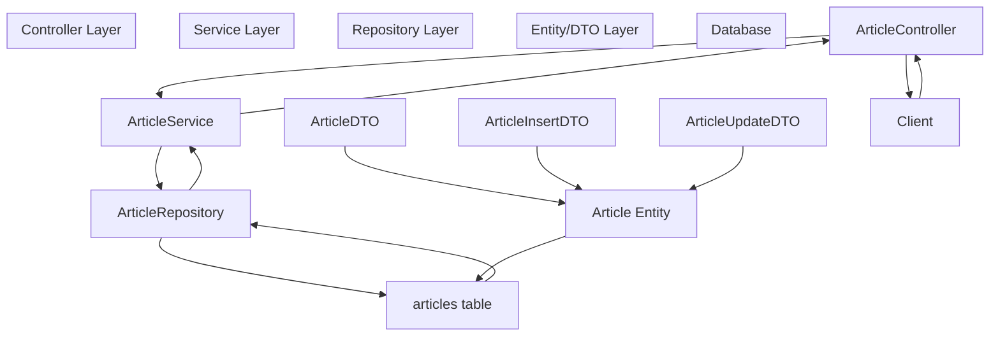
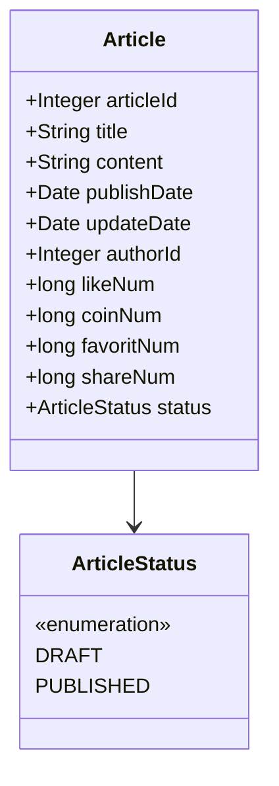
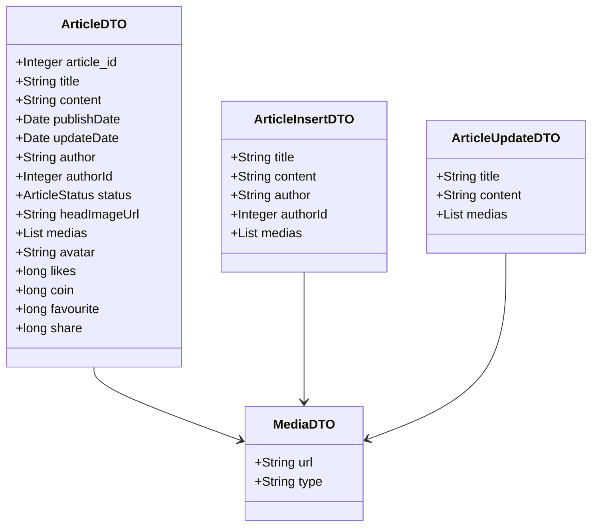
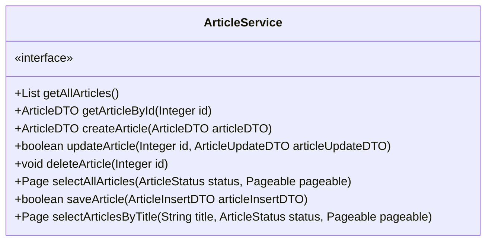
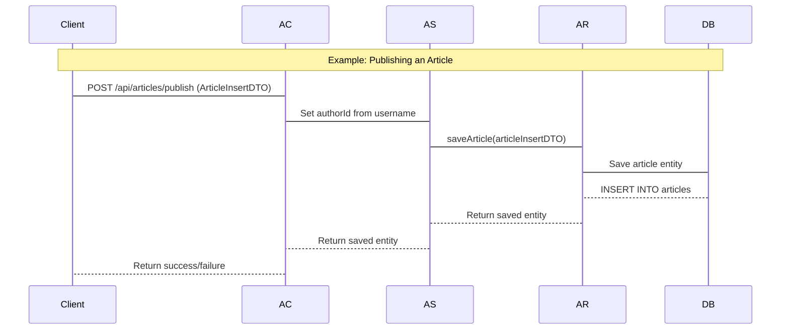

# Article Management System

> **Relevant source files**
> * [SEUNewsWebsite/src/main/java/com/royzhang/seunewswebsite/controller/ArticleController.java](https://github.com/zsqgleRoy/SEUNews/blob/9be5e28c/SEUNewsWebsite/src/main/java/com/royzhang/seunewswebsite/controller/ArticleController.java)
> * [SEUNewsWebsite/src/main/java/com/royzhang/seunewswebsite/dto/Article/ArticleDTO.java](https://github.com/zsqgleRoy/SEUNews/blob/9be5e28c/SEUNewsWebsite/src/main/java/com/royzhang/seunewswebsite/dto/Article/ArticleDTO.java)
> * [SEUNewsWebsite/src/main/java/com/royzhang/seunewswebsite/entity/Article.java](https://github.com/zsqgleRoy/SEUNews/blob/9be5e28c/SEUNewsWebsite/src/main/java/com/royzhang/seunewswebsite/entity/Article.java)
> * [SEUNewsWebsite/src/main/java/com/royzhang/seunewswebsite/service/ArticleService.java](https://github.com/zsqgleRoy/SEUNews/blob/9be5e28c/SEUNewsWebsite/src/main/java/com/royzhang/seunewswebsite/service/ArticleService.java)

The Article Management System is the core subsystem of the SEU News website responsible for handling the creation, retrieval, updating, and deletion (CRUD) of news articles. It manages the entire article lifecycle from draft to publication, and provides the foundation for user interactions with content. For information about user interactions with articles (such as likes, favorites, and coin contributions), see [User Interactions with Articles](/zsqgleRoy/SEUNews/5.1-user-interactions-with-articles).

## 1. System Overview

The Article Management System consists of several components working together to provide a complete solution for article management:



Sources: [SEUNewsWebsite/src/main/java/com/royzhang/seunewswebsite/controller/ArticleController.java](https://github.com/zsqgleRoy/SEUNews/blob/9be5e28c/SEUNewsWebsite/src/main/java/com/royzhang/seunewswebsite/controller/ArticleController.java)

 [SEUNewsWebsite/src/main/java/com/royzhang/seunewswebsite/service/ArticleService.java](https://github.com/zsqgleRoy/SEUNews/blob/9be5e28c/SEUNewsWebsite/src/main/java/com/royzhang/seunewswebsite/service/ArticleService.java)

 [SEUNewsWebsite/src/main/java/com/royzhang/seunewswebsite/entity/Article.java](https://github.com/zsqgleRoy/SEUNews/blob/9be5e28c/SEUNewsWebsite/src/main/java/com/royzhang/seunewswebsite/entity/Article.java)

 [SEUNewsWebsite/src/main/java/com/royzhang/seunewswebsite/dto/Article/ArticleDTO.java](https://github.com/zsqgleRoy/SEUNews/blob/9be5e28c/SEUNewsWebsite/src/main/java/com/royzhang/seunewswebsite/dto/Article/ArticleDTO.java)

## 2. Article Domain Model

The `Article` entity is the central domain object in the Article Management System.

### 2.1 Article Entity Structure



Sources: [SEUNewsWebsite/src/main/java/com/royzhang/seunewswebsite/entity/Article.java L13-L56](https://github.com/zsqgleRoy/SEUNews/blob/9be5e28c/SEUNewsWebsite/src/main/java/com/royzhang/seunewswebsite/entity/Article.java#L13-L56)

The `Article` entity represents a news article in the system with the following key attributes:

| Attribute | Type | Description |
| --- | --- | --- |
| articleId | Integer | Primary key, auto-incremented |
| title | String | Article title |
| content | String (Text) | Full article content |
| publishDate | Date | When the article was published |
| updateDate | Date | When the article was last updated |
| authorId | Integer | Foreign key to the User entity |
| status | ArticleStatus | Article state (DRAFT or PUBLISHED) |
| likeNum | long | Number of likes |
| coinNum | long | Number of coin contributions |
| favoritNum | long | Number of favorites |
| shareNum | long | Number of shares |

Sources: [SEUNewsWebsite/src/main/java/com/royzhang/seunewswebsite/entity/Article.java L19-L54](https://github.com/zsqgleRoy/SEUNews/blob/9be5e28c/SEUNewsWebsite/src/main/java/com/royzhang/seunewswebsite/entity/Article.java#L19-L54)

## 3. Data Transfer Objects (DTOs)

The system uses several DTOs to transfer article data between different layers and to handle specific operations:

### 3.1 DTO Structure



Sources: [SEUNewsWebsite/src/main/java/com/royzhang/seunewswebsite/dto/Article/ArticleDTO.java L12-L68](https://github.com/zsqgleRoy/SEUNews/blob/9be5e28c/SEUNewsWebsite/src/main/java/com/royzhang/seunewswebsite/dto/Article/ArticleDTO.java#L12-L68)

### 3.2 DTO Usage

* **ArticleDTO**: Used for transferring article data including all metadata, author information, interaction counts, and associated media
* **ArticleInsertDTO**: Used specifically for creating new articles
* **ArticleUpdateDTO**: Used specifically for updating existing articles
* **ArticleFrontDTO**: Used for displaying articles in the frontend

DTOs facilitate the transformation between the persistence model (Entity) and the representation used in the UI and API layers.

Sources: [SEUNewsWebsite/src/main/java/com/royzhang/seunewswebsite/dto/Article/ArticleDTO.java L31-L67](https://github.com/zsqgleRoy/SEUNews/blob/9be5e28c/SEUNewsWebsite/src/main/java/com/royzhang/seunewswebsite/dto/Article/ArticleDTO.java#L31-L67)

## 4. Article Service Interface

The `ArticleService` interface defines the business operations available for article management:



Sources: [SEUNewsWebsite/src/main/java/com/royzhang/seunewswebsite/service/ArticleService.java L16-L74](https://github.com/zsqgleRoy/SEUNews/blob/9be5e28c/SEUNewsWebsite/src/main/java/com/royzhang/seunewswebsite/service/ArticleService.java#L16-L74)

The interface provides methods for:

* Retrieving all articles
* Retrieving a specific article by ID
* Creating new articles
* Updating existing articles
* Deleting articles
* Selecting articles with pagination based on status
* Saving articles (specifically for the publishing process)
* Searching articles by title with pagination

## 5. RESTful API Endpoints

The `ArticleController` class exposes RESTful endpoints for article operations:

### 5.1 Available Endpoints

| HTTP Method | Endpoint | Description | Function |
| --- | --- | --- | --- |
| GET | /api/articles | Get all articles | getAllArticles() |
| GET | /api/articles/{id} | Get article by ID | getArticleById() |
| POST | /api/articles | Create a new article | createArticle() |
| PUT | /api/articles/{id} | Update an article | updateArticle() |
| DELETE | /api/articles/{id} | Delete an article | deleteArticle() |
| GET | /api/articles/all | List articles by status with pagination | listAllArticles() |
| GET | /api/articles/list | Get paginated articles by status | getNewsList() |
| GET | /api/articles/search | Search articles with filters | getNewsListBySearch() |
| POST | /api/articles/publish | Publish a new article | publishArticle() |
| PUT | /api/articles/update{id} | Update an existing article | updateArticle() |

Sources: [SEUNewsWebsite/src/main/java/com/royzhang/seunewswebsite/controller/ArticleController.java L22-L198](https://github.com/zsqgleRoy/SEUNews/blob/9be5e28c/SEUNewsWebsite/src/main/java/com/royzhang/seunewswebsite/controller/ArticleController.java#L22-L198)

### 5.2 Request Flow Diagram



Sources: [SEUNewsWebsite/src/main/java/com/royzhang/seunewswebsite/controller/ArticleController.java L167-L180](https://github.com/zsqgleRoy/SEUNews/blob/9be5e28c/SEUNewsWebsite/src/main/java/com/royzhang/seunewswebsite/controller/ArticleController.java#L167-L180)

## 6. Article Lifecycle

Articles in the system go through a defined lifecycle:

```
#mermaid-ek8rre54n54{font-family:ui-sans-serif,-apple-system,system-ui,Segoe UI,Helvetica;font-size:16px;fill:#333;}@keyframes edge-animation-frame{from{stroke-dashoffset:0;}}@keyframes dash{to{stroke-dashoffset:0;}}#mermaid-ek8rre54n54 .edge-animation-slow{stroke-dasharray:9,5!important;stroke-dashoffset:900;animation:dash 50s linear infinite;stroke-linecap:round;}#mermaid-ek8rre54n54 .edge-animation-fast{stroke-dasharray:9,5!important;stroke-dashoffset:900;animation:dash 20s linear infinite;stroke-linecap:round;}#mermaid-ek8rre54n54 .error-icon{fill:#dddddd;}#mermaid-ek8rre54n54 .error-text{fill:#222222;stroke:#222222;}#mermaid-ek8rre54n54 .edge-thickness-normal{stroke-width:1px;}#mermaid-ek8rre54n54 .edge-thickness-thick{stroke-width:3.5px;}#mermaid-ek8rre54n54 .edge-pattern-solid{stroke-dasharray:0;}#mermaid-ek8rre54n54 .edge-thickness-invisible{stroke-width:0;fill:none;}#mermaid-ek8rre54n54 .edge-pattern-dashed{stroke-dasharray:3;}#mermaid-ek8rre54n54 .edge-pattern-dotted{stroke-dasharray:2;}#mermaid-ek8rre54n54 .marker{fill:#999;stroke:#999;}#mermaid-ek8rre54n54 .marker.cross{stroke:#999;}#mermaid-ek8rre54n54 svg{font-family:ui-sans-serif,-apple-system,system-ui,Segoe UI,Helvetica;font-size:16px;}#mermaid-ek8rre54n54 p{margin:0;}#mermaid-ek8rre54n54 defs #statediagram-barbEnd{fill:#999;stroke:#999;}#mermaid-ek8rre54n54 g.stateGroup text{fill:#dddddd;stroke:none;font-size:10px;}#mermaid-ek8rre54n54 g.stateGroup text{fill:#333;stroke:none;font-size:10px;}#mermaid-ek8rre54n54 g.stateGroup .state-title{font-weight:bolder;fill:#333;}#mermaid-ek8rre54n54 g.stateGroup rect{fill:#ffffff;stroke:#dddddd;}#mermaid-ek8rre54n54 g.stateGroup line{stroke:#999;stroke-width:1;}#mermaid-ek8rre54n54 .transition{stroke:#999;stroke-width:1;fill:none;}#mermaid-ek8rre54n54 .stateGroup .composit{fill:#f4f4f4;border-bottom:1px;}#mermaid-ek8rre54n54 .stateGroup .alt-composit{fill:#e0e0e0;border-bottom:1px;}#mermaid-ek8rre54n54 .state-note{stroke:#e6d280;fill:#fff5ad;}#mermaid-ek8rre54n54 .state-note text{fill:#333;stroke:none;font-size:10px;}#mermaid-ek8rre54n54 .stateLabel .box{stroke:none;stroke-width:0;fill:#ffffff;opacity:0.5;}#mermaid-ek8rre54n54 .edgeLabel .label rect{fill:#ffffff;opacity:0.5;}#mermaid-ek8rre54n54 .edgeLabel{background-color:#ffffff;text-align:center;}#mermaid-ek8rre54n54 .edgeLabel p{background-color:#ffffff;}#mermaid-ek8rre54n54 .edgeLabel rect{opacity:0.5;background-color:#ffffff;fill:#ffffff;}#mermaid-ek8rre54n54 .edgeLabel .label text{fill:#333;}#mermaid-ek8rre54n54 .label div .edgeLabel{color:#333;}#mermaid-ek8rre54n54 .stateLabel text{fill:#333;font-size:10px;font-weight:bold;}#mermaid-ek8rre54n54 .node circle.state-start{fill:#999;stroke:#999;}#mermaid-ek8rre54n54 .node .fork-join{fill:#999;stroke:#999;}#mermaid-ek8rre54n54 .node circle.state-end{fill:#dddddd;stroke:#f4f4f4;stroke-width:1.5;}#mermaid-ek8rre54n54 .end-state-inner{fill:#f4f4f4;stroke-width:1.5;}#mermaid-ek8rre54n54 .node rect{fill:#ffffff;stroke:#dddddd;stroke-width:1px;}#mermaid-ek8rre54n54 .node polygon{fill:#ffffff;stroke:#dddddd;stroke-width:1px;}#mermaid-ek8rre54n54 #statediagram-barbEnd{fill:#999;}#mermaid-ek8rre54n54 .statediagram-cluster rect{fill:#ffffff;stroke:#dddddd;stroke-width:1px;}#mermaid-ek8rre54n54 .cluster-label,#mermaid-ek8rre54n54 .nodeLabel{color:#333;}#mermaid-ek8rre54n54 .statediagram-cluster rect.outer{rx:5px;ry:5px;}#mermaid-ek8rre54n54 .statediagram-state .divider{stroke:#dddddd;}#mermaid-ek8rre54n54 .statediagram-state .title-state{rx:5px;ry:5px;}#mermaid-ek8rre54n54 .statediagram-cluster.statediagram-cluster .inner{fill:#f4f4f4;}#mermaid-ek8rre54n54 .statediagram-cluster.statediagram-cluster-alt .inner{fill:#f8f8f8;}#mermaid-ek8rre54n54 .statediagram-cluster .inner{rx:0;ry:0;}#mermaid-ek8rre54n54 .statediagram-state rect.basic{rx:5px;ry:5px;}#mermaid-ek8rre54n54 .statediagram-state rect.divider{stroke-dasharray:10,10;fill:#f8f8f8;}#mermaid-ek8rre54n54 .note-edge{stroke-dasharray:5;}#mermaid-ek8rre54n54 .statediagram-note rect{fill:#fff5ad;stroke:#e6d280;stroke-width:1px;rx:0;ry:0;}#mermaid-ek8rre54n54 .statediagram-note rect{fill:#fff5ad;stroke:#e6d280;stroke-width:1px;rx:0;ry:0;}#mermaid-ek8rre54n54 .statediagram-note text{fill:#333;}#mermaid-ek8rre54n54 .statediagram-note .nodeLabel{color:#333;}#mermaid-ek8rre54n54 .statediagram .edgeLabel{color:red;}#mermaid-ek8rre54n54 #dependencyStart,#mermaid-ek8rre54n54 #dependencyEnd{fill:#999;stroke:#999;stroke-width:1;}#mermaid-ek8rre54n54 .statediagramTitleText{text-anchor:middle;font-size:18px;fill:#333;}#mermaid-ek8rre54n54 :root{--mermaid-font-family:"trebuchet ms",verdana,arial,sans-serif;}Author createsAuthor publishesAuthor editsRepublishDeleteDeleteDraftEditingPreviewPublishedLiveUserInteractionsLikesCoinsFavoritesSharesUpdated
```

The article lifecycle is managed through:

1. **Creation**: Authors create drafts using the `publishArticle()` method [SEUNewsWebsite/src/main/java/com/royzhang/seunewswebsite/controller/ArticleController.java L167-L180](https://github.com/zsqgleRoy/SEUNews/blob/9be5e28c/SEUNewsWebsite/src/main/java/com/royzhang/seunewswebsite/controller/ArticleController.java#L167-L180)
2. **Publication**: Drafts are published by setting the status to `PUBLISHED` [SEUNewsWebsite/src/main/java/com/royzhang/seunewswebsite/entity/Article.java L53-L55](https://github.com/zsqgleRoy/SEUNews/blob/9be5e28c/SEUNewsWebsite/src/main/java/com/royzhang/seunewswebsite/entity/Article.java#L53-L55)
3. **Updating**: Published articles can be updated using the `updateArticle()` method [SEUNewsWebsite/src/main/java/com/royzhang/seunewswebsite/controller/ArticleController.java L86-L89](https://github.com/zsqgleRoy/SEUNews/blob/9be5e28c/SEUNewsWebsite/src/main/java/com/royzhang/seunewswebsite/controller/ArticleController.java#L86-L89)

 and [SEUNewsWebsite/src/main/java/com/royzhang/seunewswebsite/controller/ArticleController.java L186-L198](https://github.com/zsqgleRoy/SEUNews/blob/9be5e28c/SEUNewsWebsite/src/main/java/com/royzhang/seunewswebsite/controller/ArticleController.java#L186-L198)
4. **Deletion**: Articles can be deleted using the `deleteArticle()` method [SEUNewsWebsite/src/main/java/com/royzhang/seunewswebsite/controller/ArticleController.java L96-L100](https://github.com/zsqgleRoy/SEUNews/blob/9be5e28c/SEUNewsWebsite/src/main/java/com/royzhang/seunewswebsite/controller/ArticleController.java#L96-L100)

Sources: [SEUNewsWebsite/src/main/java/com/royzhang/seunewswebsite/controller/ArticleController.java L86-L100](https://github.com/zsqgleRoy/SEUNews/blob/9be5e28c/SEUNewsWebsite/src/main/java/com/royzhang/seunewswebsite/controller/ArticleController.java#L86-L100)

 [SEUNewsWebsite/src/main/java/com/royzhang/seunewswebsite/controller/ArticleController.java L167-L198](https://github.com/zsqgleRoy/SEUNews/blob/9be5e28c/SEUNewsWebsite/src/main/java/com/royzhang/seunewswebsite/controller/ArticleController.java#L167-L198)

## 7. Article Query Operations

The system provides several ways to query and filter articles:

1. **Get All Articles**: Retrieve all articles without filtering [SEUNewsWebsite/src/main/java/com/royzhang/seunewswebsite/controller/ArticleController.java L38-L42](https://github.com/zsqgleRoy/SEUNews/blob/9be5e28c/SEUNewsWebsite/src/main/java/com/royzhang/seunewswebsite/controller/ArticleController.java#L38-L42)
2. **Get by ID**: Retrieve a specific article by its ID [SEUNewsWebsite/src/main/java/com/royzhang/seunewswebsite/controller/ArticleController.java L49-L67](https://github.com/zsqgleRoy/SEUNews/blob/9be5e28c/SEUNewsWebsite/src/main/java/com/royzhang/seunewswebsite/controller/ArticleController.java#L49-L67)
3. **Paginated Queries**:
* By status [SEUNewsWebsite/src/main/java/com/royzhang/seunewswebsite/controller/ArticleController.java L108-L115](https://github.com/zsqgleRoy/SEUNews/blob/9be5e28c/SEUNewsWebsite/src/main/java/com/royzhang/seunewswebsite/controller/ArticleController.java#L108-L115)
* By page and page size [SEUNewsWebsite/src/main/java/com/royzhang/seunewswebsite/controller/ArticleController.java L124-L133](https://github.com/zsqgleRoy/SEUNews/blob/9be5e28c/SEUNewsWebsite/src/main/java/com/royzhang/seunewswebsite/controller/ArticleController.java#L124-L133)
4. **Search**: Search articles by keyword, tags, and subtags [SEUNewsWebsite/src/main/java/com/royzhang/seunewswebsite/controller/ArticleController.java L145-L160](https://github.com/zsqgleRoy/SEUNews/blob/9be5e28c/SEUNewsWebsite/src/main/java/com/royzhang/seunewswebsite/controller/ArticleController.java#L145-L160)

Sources: [SEUNewsWebsite/src/main/java/com/royzhang/seunewswebsite/controller/ArticleController.java L38-L160](https://github.com/zsqgleRoy/SEUNews/blob/9be5e28c/SEUNewsWebsite/src/main/java/com/royzhang/seunewswebsite/controller/ArticleController.java#L38-L160)

## 8. Integration with User System

The Article Management System integrates with the User system to:

1. Retrieve author information for articles [SEUNewsWebsite/src/main/java/com/royzhang/seunewswebsite/controller/ArticleController.java L56-L65](https://github.com/zsqgleRoy/SEUNews/blob/9be5e28c/SEUNewsWebsite/src/main/java/com/royzhang/seunewswebsite/controller/ArticleController.java#L56-L65)
2. Associate articles with their authors during creation [SEUNewsWebsite/src/main/java/com/royzhang/seunewswebsite/controller/ArticleController.java

170](https://github.com/zsqgleRoy/SEUNews/blob/9be5e28c/SEUNewsWebsite/src/main/java/com/royzhang/seunewswebsite/controller/ArticleController.java#L170-L170)
3. Display author username and avatar in article DTOs [SEUNewsWebsite/src/main/java/com/royzhang/seunewswebsite/dto/Article/ArticleDTO.java L52-L67](https://github.com/zsqgleRoy/SEUNews/blob/9be5e28c/SEUNewsWebsite/src/main/java/com/royzhang/seunewswebsite/dto/Article/ArticleDTO.java#L52-L67)

This integration ensures that articles are properly associated with their authors and that author information is displayed alongside articles.

Sources: [SEUNewsWebsite/src/main/java/com/royzhang/seunewswebsite/controller/ArticleController.java L56-L65](https://github.com/zsqgleRoy/SEUNews/blob/9be5e28c/SEUNewsWebsite/src/main/java/com/royzhang/seunewswebsite/controller/ArticleController.java#L56-L65)

 [SEUNewsWebsite/src/main/java/com/royzhang/seunewswebsite/dto/Article/ArticleDTO.java L52-L67](https://github.com/zsqgleRoy/SEUNews/blob/9be5e28c/SEUNewsWebsite/src/main/java/com/royzhang/seunewswebsite/dto/Article/ArticleDTO.java#L52-L67)

## Summary

The Article Management System provides a complete solution for handling news articles in the SEU News website. It supports the entire article lifecycle from creation to deletion, provides flexible query capabilities, and integrates with other system components like the User System. The RESTful API design allows for easy integration with the frontend application, while the use of DTOs provides a clean separation between the persistence and presentation layers.