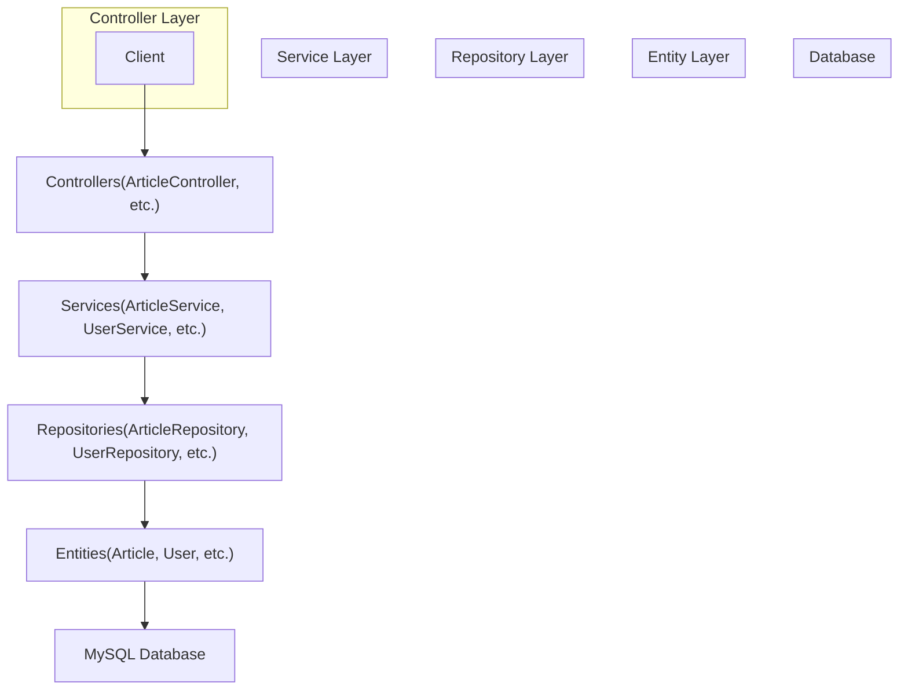
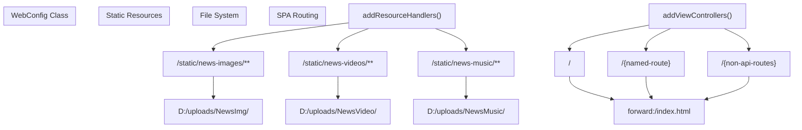
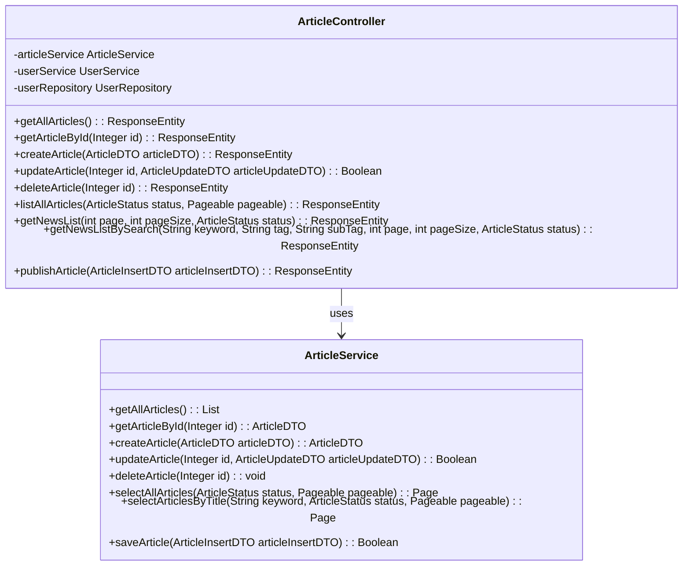
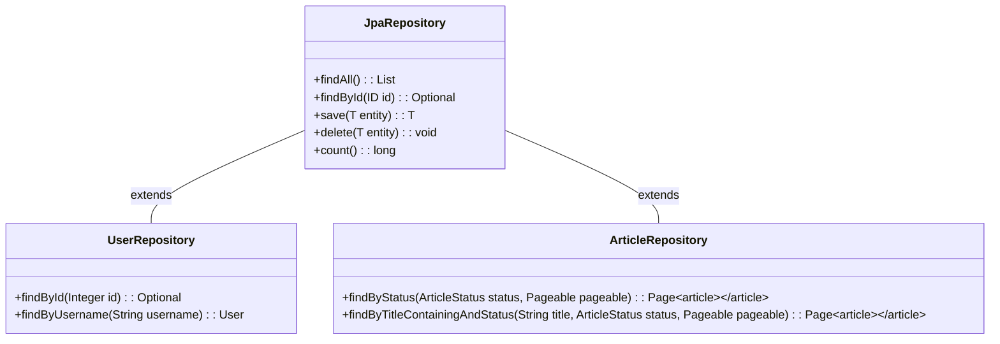
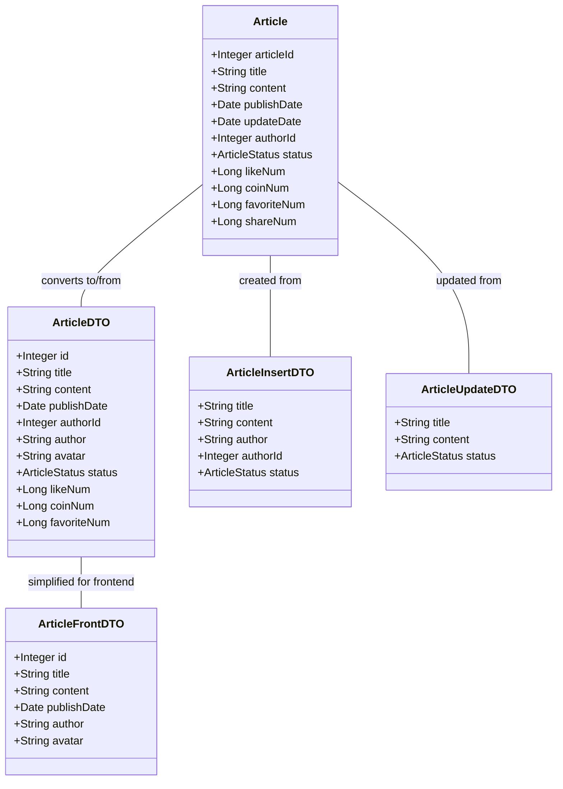
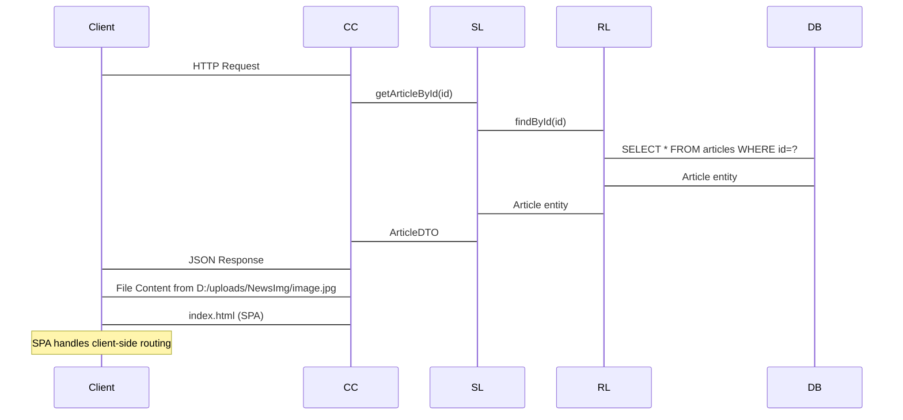

# Backend Implementation

> **Relevant source files**
> * [SEUNewsWebsite/src/main/java/com/royzhang/seunewswebsite/WebConfig.java](https://github.com/zsqgleRoy/SEUNews/blob/9be5e28c/SEUNewsWebsite/src/main/java/com/royzhang/seunewswebsite/WebConfig.java)
> * [SEUNewsWebsite/src/main/java/com/royzhang/seunewswebsite/controller/ArticleController.java](https://github.com/zsqgleRoy/SEUNews/blob/9be5e28c/SEUNewsWebsite/src/main/java/com/royzhang/seunewswebsite/controller/ArticleController.java)

This document provides a comprehensive overview of the Spring Boot backend implementation for the SEU News website. It covers the architectural structure, key components, and how these components work together to provide the system's functionality.

For detailed information about specific API endpoints, see [Controllers](/zsqgleRoy/SEUNews/4.1-controllers). For information about the business logic implementation, see [Service Layer](/zsqgleRoy/SEUNews/4.2-service-layer).

## Architecture Overview

The SEU News backend follows a standard layered architecture pattern typical of Spring Boot applications, with clear separation of concerns between the different layers.



Sources: [SEUNewsWebsite/src/main/java/com/royzhang/seunewswebsite/controller/ArticleController.java L22-L199](https://github.com/zsqgleRoy/SEUNews/blob/9be5e28c/SEUNewsWebsite/src/main/java/com/royzhang/seunewswebsite/controller/ArticleController.java#L22-L199)

## Core Components

### Web Configuration

The `WebConfig` class serves two critical purposes:

1. **Static Resource Handling**: Maps URL patterns to file system locations for news media
2. **SPA Routing Support**: Forwards non-API requests to the frontend SPA



Sources: [SEUNewsWebsite/src/main/java/com/royzhang/seunewswebsite/WebConfig.java L8-L22](https://github.com/zsqgleRoy/SEUNews/blob/9be5e28c/SEUNewsWebsite/src/main/java/com/royzhang/seunewswebsite/WebConfig.java#L8-L22)

### Controllers

The controllers handle HTTP requests, process input data, and delegate business operations to the service layer. They are responsible for:

1. Defining API endpoints
2. Request validation
3. Response formatting
4. Error handling

The `ArticleController` serves as a primary example, providing endpoints for article management:

| Endpoint | Method | Description | Implementation |
| --- | --- | --- | --- |
| `/api/articles` | GET | Get all articles | `getAllArticles()` |
| `/api/articles/{id}` | GET | Get article by ID | `getArticleById()` |
| `/api/articles` | POST | Create a new article | `createArticle()` |
| `/api/articles/{id}` | PUT | Update an article | `updateArticle()` |
| `/api/articles/{id}` | DELETE | Delete an article | `deleteArticle()` |
| `/api/articles/all` | GET | Paginated articles by status | `listAllArticles()` |
| `/api/articles/list` | GET | Paginated articles list | `getNewsList()` |
| `/api/articles/search` | GET | Search articles | `getNewsListBySearch()` |
| `/api/articles/publish` | POST | Publish a new article | `publishArticle()` |

Sources: [SEUNewsWebsite/src/main/java/com/royzhang/seunewswebsite/controller/ArticleController.java L22-L199](https://github.com/zsqgleRoy/SEUNews/blob/9be5e28c/SEUNewsWebsite/src/main/java/com/royzhang/seunewswebsite/controller/ArticleController.java#L22-L199)

### Services

The service layer contains the core business logic of the application, separated from HTTP concerns. For example, `ArticleService` manages article-related operations:



Sources: [SEUNewsWebsite/src/main/java/com/royzhang/seunewswebsite/controller/ArticleController.java L22-L199](https://github.com/zsqgleRoy/SEUNews/blob/9be5e28c/SEUNewsWebsite/src/main/java/com/royzhang/seunewswebsite/controller/ArticleController.java#L22-L199)

### Repositories

The repository layer provides data access functionality using Spring Data JPA. Each entity typically has a corresponding repository interface that extends JpaRepository, providing standard CRUD operations and the ability to define custom queries.



Sources: [SEUNewsWebsite/src/main/java/com/royzhang/seunewswebsite/controller/ArticleController.java L31-L32](https://github.com/zsqgleRoy/SEUNews/blob/9be5e28c/SEUNewsWebsite/src/main/java/com/royzhang/seunewswebsite/controller/ArticleController.java#L31-L32)

### Entity Model

The entity model consists of JPA entities mapped to database tables. These classes use annotations to define the mapping between Java objects and database tables.

Core entities include:

* `Article`: Represents news articles
* `User`: Represents system users
* `ArticleLike`, `ArticleFavorite`, `ArticleCoin`: Track user interactions with articles

### Data Transfer Objects (DTOs)

DTOs facilitate data transfer between layers, especially between the controller and service layers. They help to:

* Decouple the API from the database schema
* Control what data is exposed through the API
* Transform data between different representations

For the Article entity, several DTOs serve different purposes:



Sources: [SEUNewsWebsite/src/main/java/com/royzhang/seunewswebsite/controller/ArticleController.java L3-L6](https://github.com/zsqgleRoy/SEUNews/blob/9be5e28c/SEUNewsWebsite/src/main/java/com/royzhang/seunewswebsite/controller/ArticleController.java#L3-L6)

 [SEUNewsWebsite/src/main/java/com/royzhang/seunewswebsite/controller/ArticleController.java L49-L67](https://github.com/zsqgleRoy/SEUNews/blob/9be5e28c/SEUNewsWebsite/src/main/java/com/royzhang/seunewswebsite/controller/ArticleController.java#L49-L67)

 [SEUNewsWebsite/src/main/java/com/royzhang/seunewswebsite/controller/ArticleController.java L167-L179](https://github.com/zsqgleRoy/SEUNews/blob/9be5e28c/SEUNewsWebsite/src/main/java/com/royzhang/seunewswebsite/controller/ArticleController.java#L167-L179)

## Request Processing Flow

The following diagram illustrates how a typical request is processed through the backend system:



Sources: [SEUNewsWebsite/src/main/java/com/royzhang/seunewswebsite/WebConfig.java L11-L15](https://github.com/zsqgleRoy/SEUNews/blob/9be5e28c/SEUNewsWebsite/src/main/java/com/royzhang/seunewswebsite/WebConfig.java#L11-L15)

 [SEUNewsWebsite/src/main/java/com/royzhang/seunewswebsite/WebConfig.java L16-L21](https://github.com/zsqgleRoy/SEUNews/blob/9be5e28c/SEUNewsWebsite/src/main/java/com/royzhang/seunewswebsite/WebConfig.java#L16-L21)

 [SEUNewsWebsite/src/main/java/com/royzhang/seunewswebsite/controller/ArticleController.java L49-L67](https://github.com/zsqgleRoy/SEUNews/blob/9be5e28c/SEUNewsWebsite/src/main/java/com/royzhang/seunewswebsite/controller/ArticleController.java#L49-L67)

## Error Handling

The controllers implement error handling through HTTP status codes and appropriate response bodies:

1. **Not Found (404)**: Returned when a requested resource does not exist

```
return ResponseEntity.notFound().build();
```
2. **Internal Server Error (500)**: Returned when server-side processing fails

```
return new ResponseEntity<>("新闻保存失败，请稍后重试", HttpStatus.INTERNAL_SERVER_ERROR);
```
3. **Created (201)**: Returned after successful resource creation

```
return new ResponseEntity<>(createdArticle, HttpStatus.CREATED);
```
4. **No Content (204)**: Returned after successful deletion

```
return new ResponseEntity<>(HttpStatus.NO_CONTENT);
```

Sources: [SEUNewsWebsite/src/main/java/com/royzhang/seunewswebsite/controller/ArticleController.java L52-L54](https://github.com/zsqgleRoy/SEUNews/blob/9be5e28c/SEUNewsWebsite/src/main/java/com/royzhang/seunewswebsite/controller/ArticleController.java#L52-L54)

 [SEUNewsWebsite/src/main/java/com/royzhang/seunewswebsite/controller/ArticleController.java L174-L178](https://github.com/zsqgleRoy/SEUNews/blob/9be5e28c/SEUNewsWebsite/src/main/java/com/royzhang/seunewswebsite/controller/ArticleController.java#L174-L178)

 [SEUNewsWebsite/src/main/java/com/royzhang/seunewswebsite/controller/ArticleController.java L76-L77](https://github.com/zsqgleRoy/SEUNews/blob/9be5e28c/SEUNewsWebsite/src/main/java/com/royzhang/seunewswebsite/controller/ArticleController.java#L76-L77)

 [SEUNewsWebsite/src/main/java/com/royzhang/seunewswebsite/controller/ArticleController.java L98-L99](https://github.com/zsqgleRoy/SEUNews/blob/9be5e28c/SEUNewsWebsite/src/main/java/com/royzhang/seunewswebsite/controller/ArticleController.java#L98-L99)

## Summary

The SEU News backend implementation follows standard Spring Boot architecture practices with clearly separated responsibilities across layers. The system uses:

* Spring MVC for handling HTTP requests and responses
* Spring Data JPA for database operations
* DTOs for data transformation
* Custom configuration for static resource handling and SPA routing

This architecture provides a robust foundation for the news website's functionality, including article management, user authentication, and content delivery.