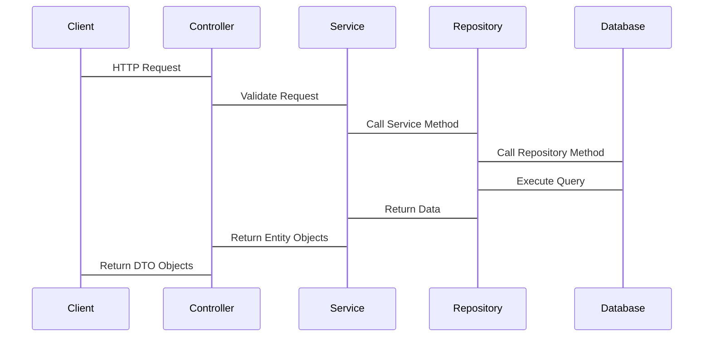
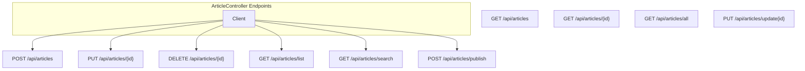
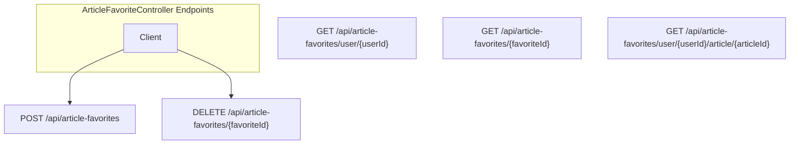
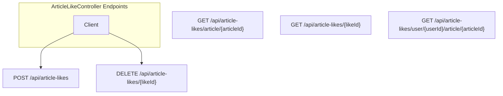
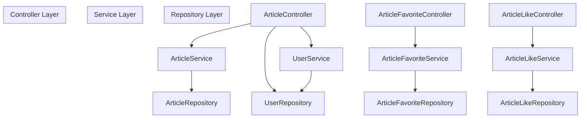
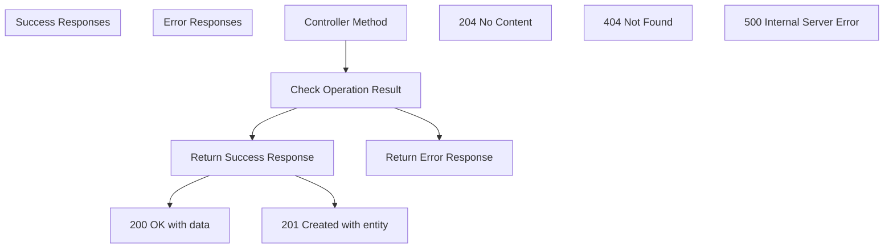
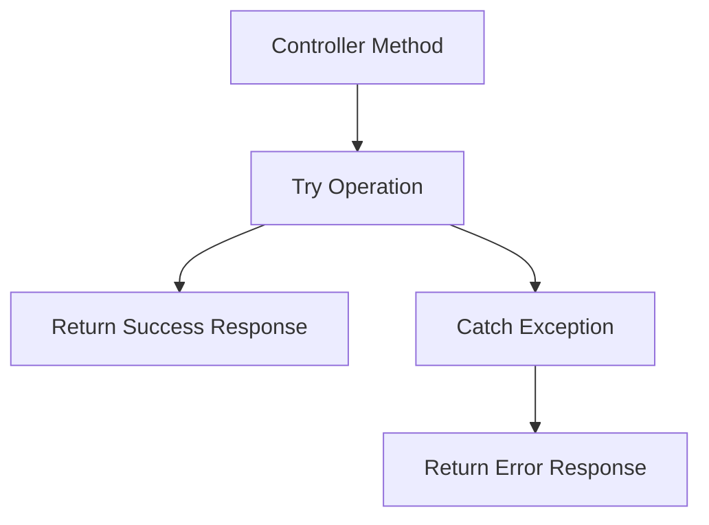

# Controllers

> **Relevant source files**
> * [SEUNewsWebsite/src/main/java/com/royzhang/seunewswebsite/controller/ArticleController.java](https://github.com/zsqgleRoy/SEUNews/blob/9be5e28c/SEUNewsWebsite/src/main/java/com/royzhang/seunewswebsite/controller/ArticleController.java)
> * [SEUNewsWebsite/src/main/java/com/royzhang/seunewswebsite/controller/ArticleFavoriteController.java](https://github.com/zsqgleRoy/SEUNews/blob/9be5e28c/SEUNewsWebsite/src/main/java/com/royzhang/seunewswebsite/controller/ArticleFavoriteController.java)
> * [SEUNewsWebsite/src/main/java/com/royzhang/seunewswebsite/controller/ArticleLikeController.java](https://github.com/zsqgleRoy/SEUNews/blob/9be5e28c/SEUNewsWebsite/src/main/java/com/royzhang/seunewswebsite/controller/ArticleLikeController.java)

## Purpose and Scope

This document covers the REST API controllers in the SEUNews system, which serve as the entry points for client requests. Controllers handle HTTP requests, validate input data, delegate business logic to services, and format responses. For information about the backend business logic implementation, see [Service Layer](/zsqgleRoy/SEUNews/4.2-service-layer).

## Controller Overview

The SEUNews system implements a standard REST API architecture with multiple controllers that handle different aspects of the application's functionality. Each controller is responsible for a specific domain area and follows RESTful conventions.

```

```

Sources:

* [SEUNewsWebsite/src/main/java/com/royzhang/seunewswebsite/controller/ArticleController.java L22-L24](https://github.com/zsqgleRoy/SEUNews/blob/9be5e28c/SEUNewsWebsite/src/main/java/com/royzhang/seunewswebsite/controller/ArticleController.java#L22-L24)
* [SEUNewsWebsite/src/main/java/com/royzhang/seunewswebsite/controller/ArticleFavoriteController.java L12-L14](https://github.com/zsqgleRoy/SEUNews/blob/9be5e28c/SEUNewsWebsite/src/main/java/com/royzhang/seunewswebsite/controller/ArticleFavoriteController.java#L12-L14)
* [SEUNewsWebsite/src/main/java/com/royzhang/seunewswebsite/controller/ArticleLikeController.java L12-L14](https://github.com/zsqgleRoy/SEUNews/blob/9be5e28c/SEUNewsWebsite/src/main/java/com/royzhang/seunewswebsite/controller/ArticleLikeController.java#L12-L14)

## Controller Request Flow

The request flow in the SEUNews system follows a standard pattern for handling API requests:



Sources:

* [SEUNewsWebsite/src/main/java/com/royzhang/seunewswebsite/controller/ArticleController.java L38-L67](https://github.com/zsqgleRoy/SEUNews/blob/9be5e28c/SEUNewsWebsite/src/main/java/com/royzhang/seunewswebsite/controller/ArticleController.java#L38-L67)
* [SEUNewsWebsite/src/main/java/com/royzhang/seunewswebsite/controller/ArticleFavoriteController.java L25-L32](https://github.com/zsqgleRoy/SEUNews/blob/9be5e28c/SEUNewsWebsite/src/main/java/com/royzhang/seunewswebsite/controller/ArticleFavoriteController.java#L25-L32)

## Controller Endpoints

The SEUNews API provides numerous endpoints distributed across different controllers. Each endpoint handles specific functionalities related to news articles and user interactions.

### Article Controller Endpoints

The ArticleController handles all operations related to articles including creating, retrieving, updating, and deleting articles.

Base Path: `/api/articles`

| Method | Endpoint | Description | Request Body | Response |
| --- | --- | --- | --- | --- |
| GET | `/` | Get all articles | - | List of ArticleDTO |
| GET | `/{id}` | Get article by ID | - | ArticleDTO |
| POST | `/` | Create article | ArticleDTO | Created ArticleDTO |
| PUT | `/{id}` | Update article | ArticleUpdateDTO | Boolean (success) |
| DELETE | `/{id}` | Delete article | - | No content (204) |
| GET | `/all` | Get paginated articles by status | status, pageable | Page |
| GET | `/list` | Get paginated articles | page, pageSize, status | Page |
| GET | `/search` | Search articles | keyword, tag, subTag, page, pageSize, status | Page |
| POST | `/publish` | Publish article | ArticleInsertDTO | String (response message) |
| PUT | `/update{id}` | Update article | ArticleUpdateDTO | String (response message) |



Sources:

* [SEUNewsWebsite/src/main/java/com/royzhang/seunewswebsite/controller/ArticleController.java L38-L42](https://github.com/zsqgleRoy/SEUNews/blob/9be5e28c/SEUNewsWebsite/src/main/java/com/royzhang/seunewswebsite/controller/ArticleController.java#L38-L42)
* [SEUNewsWebsite/src/main/java/com/royzhang/seunewswebsite/controller/ArticleController.java L49-L67](https://github.com/zsqgleRoy/SEUNews/blob/9be5e28c/SEUNewsWebsite/src/main/java/com/royzhang/seunewswebsite/controller/ArticleController.java#L49-L67)
* [SEUNewsWebsite/src/main/java/com/royzhang/seunewswebsite/controller/ArticleController.java L74-L78](https://github.com/zsqgleRoy/SEUNews/blob/9be5e28c/SEUNewsWebsite/src/main/java/com/royzhang/seunewswebsite/controller/ArticleController.java#L74-L78)
* [SEUNewsWebsite/src/main/java/com/royzhang/seunewswebsite/controller/ArticleController.java L86-L89](https://github.com/zsqgleRoy/SEUNews/blob/9be5e28c/SEUNewsWebsite/src/main/java/com/royzhang/seunewswebsite/controller/ArticleController.java#L86-L89)
* [SEUNewsWebsite/src/main/java/com/royzhang/seunewswebsite/controller/ArticleController.java L96-L100](https://github.com/zsqgleRoy/SEUNews/blob/9be5e28c/SEUNewsWebsite/src/main/java/com/royzhang/seunewswebsite/controller/ArticleController.java#L96-L100)
* [SEUNewsWebsite/src/main/java/com/royzhang/seunewswebsite/controller/ArticleController.java L108-L115](https://github.com/zsqgleRoy/SEUNews/blob/9be5e28c/SEUNewsWebsite/src/main/java/com/royzhang/seunewswebsite/controller/ArticleController.java#L108-L115)
* [SEUNewsWebsite/src/main/java/com/royzhang/seunewswebsite/controller/ArticleController.java L124-L133](https://github.com/zsqgleRoy/SEUNews/blob/9be5e28c/SEUNewsWebsite/src/main/java/com/royzhang/seunewswebsite/controller/ArticleController.java#L124-L133)
* [SEUNewsWebsite/src/main/java/com/royzhang/seunewswebsite/controller/ArticleController.java L145-L160](https://github.com/zsqgleRoy/SEUNews/blob/9be5e28c/SEUNewsWebsite/src/main/java/com/royzhang/seunewswebsite/controller/ArticleController.java#L145-L160)
* [SEUNewsWebsite/src/main/java/com/royzhang/seunewswebsite/controller/ArticleController.java L167-L180](https://github.com/zsqgleRoy/SEUNews/blob/9be5e28c/SEUNewsWebsite/src/main/java/com/royzhang/seunewswebsite/controller/ArticleController.java#L167-L180)
* [SEUNewsWebsite/src/main/java/com/royzhang/seunewswebsite/controller/ArticleController.java L186-L198](https://github.com/zsqgleRoy/SEUNews/blob/9be5e28c/SEUNewsWebsite/src/main/java/com/royzhang/seunewswebsite/controller/ArticleController.java#L186-L198)

### Article Favorite Controller Endpoints

The ArticleFavoriteController manages user favorites for articles, allowing users to save and manage their favorite articles.

Base Path: `/api/article-favorites`

| Method | Endpoint | Description | Request Body | Response |
| --- | --- | --- | --- | --- |
| GET | `/user/{userId}` | Get all favorites by user ID | - | List of ArticleFavoriteDTO |
| GET | `/{favoriteId}` | Get favorite by ID | - | ArticleFavoriteDTO |
| POST | `/` | Create favorite | ArticleFavoriteDTO | Created ArticleFavoriteDTO |
| DELETE | `/{favoriteId}` | Delete favorite | - | No content (204) |
| GET | `/user/{userId}/article/{articleId}` | Check if article is favorited by user | - | Boolean |



Sources:

* [SEUNewsWebsite/src/main/java/com/royzhang/seunewswebsite/controller/ArticleFavoriteController.java L19-L23](https://github.com/zsqgleRoy/SEUNews/blob/9be5e28c/SEUNewsWebsite/src/main/java/com/royzhang/seunewswebsite/controller/ArticleFavoriteController.java#L19-L23)
* [SEUNewsWebsite/src/main/java/com/royzhang/seunewswebsite/controller/ArticleFavoriteController.java L25-L32](https://github.com/zsqgleRoy/SEUNews/blob/9be5e28c/SEUNewsWebsite/src/main/java/com/royzhang/seunewswebsite/controller/ArticleFavoriteController.java#L25-L32)
* [SEUNewsWebsite/src/main/java/com/royzhang/seunewswebsite/controller/ArticleFavoriteController.java L34-L38](https://github.com/zsqgleRoy/SEUNews/blob/9be5e28c/SEUNewsWebsite/src/main/java/com/royzhang/seunewswebsite/controller/ArticleFavoriteController.java#L34-L38)
* [SEUNewsWebsite/src/main/java/com/royzhang/seunewswebsite/controller/ArticleFavoriteController.java L40-L44](https://github.com/zsqgleRoy/SEUNews/blob/9be5e28c/SEUNewsWebsite/src/main/java/com/royzhang/seunewswebsite/controller/ArticleFavoriteController.java#L40-L44)
* [SEUNewsWebsite/src/main/java/com/royzhang/seunewswebsite/controller/ArticleFavoriteController.java L46-L50](https://github.com/zsqgleRoy/SEUNews/blob/9be5e28c/SEUNewsWebsite/src/main/java/com/royzhang/seunewswebsite/controller/ArticleFavoriteController.java#L46-L50)

### Article Like Controller Endpoints

The ArticleLikeController handles user likes for articles, allowing users to like or unlike articles and check the like status.

Base Path: `/api/article-likes`

| Method | Endpoint | Description | Request Body | Response |
| --- | --- | --- | --- | --- |
| GET | `/article/{articleId}` | Get all likes by article ID | - | List of ArticleLikeDTO |
| GET | `/{likeId}` | Get like by ID | - | ArticleLikeDTO |
| POST | `/` | Create like | ArticleLikeDTO | Created ArticleLikeDTO |
| DELETE | `/{likeId}` | Delete like | - | No content (204) |
| GET | `/user/{userId}/article/{articleId}` | Check if article is liked by user | - | Boolean |



Sources:

* [SEUNewsWebsite/src/main/java/com/royzhang/seunewswebsite/controller/ArticleLikeController.java L19-L23](https://github.com/zsqgleRoy/SEUNews/blob/9be5e28c/SEUNewsWebsite/src/main/java/com/royzhang/seunewswebsite/controller/ArticleLikeController.java#L19-L23)
* [SEUNewsWebsite/src/main/java/com/royzhang/seunewswebsite/controller/ArticleLikeController.java L25-L32](https://github.com/zsqgleRoy/SEUNews/blob/9be5e28c/SEUNewsWebsite/src/main/java/com/royzhang/seunewswebsite/controller/ArticleLikeController.java#L25-L32)
* [SEUNewsWebsite/src/main/java/com/royzhang/seunewswebsite/controller/ArticleLikeController.java L34-L38](https://github.com/zsqgleRoy/SEUNews/blob/9be5e28c/SEUNewsWebsite/src/main/java/com/royzhang/seunewswebsite/controller/ArticleLikeController.java#L34-L38)
* [SEUNewsWebsite/src/main/java/com/royzhang/seunewswebsite/controller/ArticleLikeController.java L40-L44](https://github.com/zsqgleRoy/SEUNews/blob/9be5e28c/SEUNewsWebsite/src/main/java/com/royzhang/seunewswebsite/controller/ArticleLikeController.java#L40-L44)
* [SEUNewsWebsite/src/main/java/com/royzhang/seunewswebsite/controller/ArticleLikeController.java L46-L50](https://github.com/zsqgleRoy/SEUNews/blob/9be5e28c/SEUNewsWebsite/src/main/java/com/royzhang/seunewswebsite/controller/ArticleLikeController.java#L46-L50)

## Controller-Service Interaction

Controllers in the SEUNews system delegate business logic to their respective service classes. This separation of concerns ensures that controllers focus on handling HTTP requests and responses, while services handle the business logic.



Sources:

* [SEUNewsWebsite/src/main/java/com/royzhang/seunewswebsite/controller/ArticleController.java L26-L32](https://github.com/zsqgleRoy/SEUNews/blob/9be5e28c/SEUNewsWebsite/src/main/java/com/royzhang/seunewswebsite/controller/ArticleController.java#L26-L32)
* [SEUNewsWebsite/src/main/java/com/royzhang/seunewswebsite/controller/ArticleFavoriteController.java L16-L17](https://github.com/zsqgleRoy/SEUNews/blob/9be5e28c/SEUNewsWebsite/src/main/java/com/royzhang/seunewswebsite/controller/ArticleFavoriteController.java#L16-L17)
* [SEUNewsWebsite/src/main/java/com/royzhang/seunewswebsite/controller/ArticleLikeController.java L16-L17](https://github.com/zsqgleRoy/SEUNews/blob/9be5e28c/SEUNewsWebsite/src/main/java/com/royzhang/seunewswebsite/controller/ArticleLikeController.java#L16-L17)

## Response Handling

Controllers use Spring's `ResponseEntity` class to build HTTP responses with appropriate status codes and response bodies. This provides fine-grained control over the HTTP response.

### Common Response Patterns

| Operation | Success Response | Error Response |
| --- | --- | --- |
| GET | 200 OK with data | 404 Not Found |
| CREATE | 201 Created with created entity | 500 Internal Server Error with message |
| UPDATE | 200 OK with success status or message | 500 Internal Server Error with message |
| DELETE | 204 No Content | - |



Sources:

* [SEUNewsWebsite/src/main/java/com/royzhang/seunewswebsite/controller/ArticleController.java L49-L67](https://github.com/zsqgleRoy/SEUNews/blob/9be5e28c/SEUNewsWebsite/src/main/java/com/royzhang/seunewswebsite/controller/ArticleController.java#L49-L67)
* [SEUNewsWebsite/src/main/java/com/royzhang/seunewswebsite/controller/ArticleController.java L74-L78](https://github.com/zsqgleRoy/SEUNews/blob/9be5e28c/SEUNewsWebsite/src/main/java/com/royzhang/seunewswebsite/controller/ArticleController.java#L74-L78)
* [SEUNewsWebsite/src/main/java/com/royzhang/seunewswebsite/controller/ArticleController.java L96-L100](https://github.com/zsqgleRoy/SEUNews/blob/9be5e28c/SEUNewsWebsite/src/main/java/com/royzhang/seunewswebsite/controller/ArticleController.java#L96-L100)
* [SEUNewsWebsite/src/main/java/com/royzhang/seunewswebsite/controller/ArticleFavoriteController.java L25-L32](https://github.com/zsqgleRoy/SEUNews/blob/9be5e28c/SEUNewsWebsite/src/main/java/com/royzhang/seunewswebsite/controller/ArticleFavoriteController.java#L25-L32)

## Exception Handling

Controllers handle exceptions by using try-catch blocks for critical operations and returning appropriate error responses. This ensures that clients receive meaningful error messages when operations fail.



Sources:

* [SEUNewsWebsite/src/main/java/com/royzhang/seunewswebsite/controller/ArticleController.java L167-L180](https://github.com/zsqgleRoy/SEUNews/blob/9be5e28c/SEUNewsWebsite/src/main/java/com/royzhang/seunewswebsite/controller/ArticleController.java#L167-L180)
* [SEUNewsWebsite/src/main/java/com/royzhang/seunewswebsite/controller/ArticleController.java L186-L198](https://github.com/zsqgleRoy/SEUNews/blob/9be5e28c/SEUNewsWebsite/src/main/java/com/royzhang/seunewswebsite/controller/ArticleController.java#L186-L198)

## Summary

The Controllers in the SEUNews system provide a RESTful API for client applications to interact with the system. They handle HTTP requests, delegate business logic to services, and format responses. The system implements three main controllers:

1. **ArticleController** - handles operations related to articles
2. **ArticleFavoriteController** - manages user favorites for articles
3. **ArticleLikeController** - manages user likes for articles

All controllers follow RESTful conventions and use standard HTTP methods and status codes. They validate input data, delegate business logic to services, and handle exceptions appropriately.