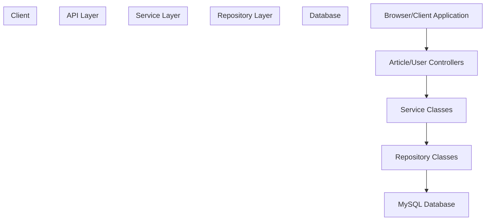
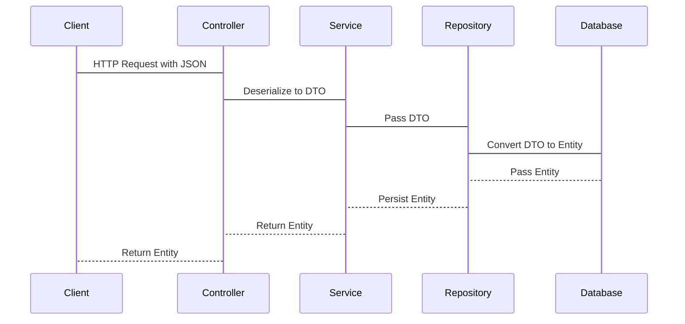

# Data Transfer Objects

> **Relevant source files**
> * [SEUNewsWebsite/src/main/java/com/royzhang/seunewswebsite/dto/Article/ArticleDTO.java](https://github.com/zsqgleRoy/SEUNews/blob/9be5e28c/SEUNewsWebsite/src/main/java/com/royzhang/seunewswebsite/dto/Article/ArticleDTO.java)

## Purpose and Overview

Data Transfer Objects (DTOs) in the SEUNews system serve as specialized classes that facilitate the transfer of data between different layers of the application. They provide a clean separation between the internal domain model (entities) and the external API representation, allowing each to evolve independently.

This document explains the DTO pattern as implemented in the SEUNews application, including their structure, types, and relationship to domain entities. For information about the domain entities themselves, see [Entity Model](/zsqgleRoy/SEUNews/4.4-entity-model).

## DTO Pattern in SEUNews

The SEUNews application implements the DTO pattern to solve several common challenges in web application development:

1. **API Contract Stability** - DTOs provide a stable interface for clients, independent of internal model changes
2. **Data Filtering** - DTOs contain only the fields necessary for specific use cases
3. **Performance Optimization** - DTOs can reduce unnecessary data transfer
4. **Data Transformation** - DTOs allow for data to be restructured to meet client-specific needs



Title: DTO Communication Flow in SEUNews System

Sources: [SEUNewsWebsite/src/main/java/com/royzhang/seunewswebsite/dto/Article/ArticleDTO.java](https://github.com/zsqgleRoy/SEUNews/blob/9be5e28c/SEUNewsWebsite/src/main/java/com/royzhang/seunewswebsite/dto/Article/ArticleDTO.java)

## Types of DTOs in SEUNews

The SEUNews system implements several types of DTOs for different purposes:

### 1. Standard DTOs

These DTOs represent domain entities for general-purpose data transfer. They typically include most or all properties of the entity they represent.

### 2. Specialized DTOs

These DTOs are designed for specific operations:

| DTO Type | Purpose | Typical Context |
| --- | --- | --- |
| InsertDTO | Used for creating new resources | POST requests |
| UpdateDTO | Used for modifying existing resources | PUT/PATCH requests |
| FrontDTO | Tailored for frontend display with additional presentation-related data | GET requests |

### 3. Composite DTOs

These DTOs combine data from multiple entities to provide a comprehensive view for specific use cases.

```

```

Title: Composite DTO Relationships in SEUNews

Sources: [SEUNewsWebsite/src/main/java/com/royzhang/seunewswebsite/dto/Article/ArticleDTO.java L15-L29](https://github.com/zsqgleRoy/SEUNews/blob/9be5e28c/SEUNewsWebsite/src/main/java/com/royzhang/seunewswebsite/dto/Article/ArticleDTO.java#L15-L29)

## DTO to Entity Mapping

DTOs in the SEUNews system are carefully mapped to and from domain entities. This mapping typically occurs in the service layer, where DTOs received from controllers are converted to entities for business logic processing, and entities from repositories are converted to DTOs for returning to controllers.



Title: DTO Transformation Flow in SEUNews System

Sources: [SEUNewsWebsite/src/main/java/com/royzhang/seunewswebsite/dto/Article/ArticleDTO.java L33-L67](https://github.com/zsqgleRoy/SEUNews/blob/9be5e28c/SEUNewsWebsite/src/main/java/com/royzhang/seunewswebsite/dto/Article/ArticleDTO.java#L33-L67)

## ArticleDTO Example

The `ArticleDTO` class is a prime example of DTO implementation in the SEUNews system:

```

```

Title: Article Entity to ArticleDTO Mapping

Sources: [SEUNewsWebsite/src/main/java/com/royzhang/seunewswebsite/dto/Article/ArticleDTO.java](https://github.com/zsqgleRoy/SEUNews/blob/9be5e28c/SEUNewsWebsite/src/main/java/com/royzhang/seunewswebsite/dto/Article/ArticleDTO.java)

### Constructors

The `ArticleDTO` class has multiple constructors to facilitate various mapping scenarios:

1. **Default Constructor** - Creates an empty DTO
[SEUNewsWebsite/src/main/java/com/royzhang/seunewswebsite/dto/Article/ArticleDTO.java

31](https://github.com/zsqgleRoy/SEUNews/blob/9be5e28c/SEUNewsWebsite/src/main/java/com/royzhang/seunewswebsite/dto/Article/ArticleDTO.java#L31-L31)
2. **Basic Entity Mapping** - Maps core entity properties
[SEUNewsWebsite/src/main/java/com/royzhang/seunewswebsite/dto/Article/ArticleDTO.java L33-L41](https://github.com/zsqgleRoy/SEUNews/blob/9be5e28c/SEUNewsWebsite/src/main/java/com/royzhang/seunewswebsite/dto/Article/ArticleDTO.java#L33-L41)
3. **Entity with Image URL** - Adds head image URL to basic mapping
[SEUNewsWebsite/src/main/java/com/royzhang/seunewswebsite/dto/Article/ArticleDTO.java L42-L51](https://github.com/zsqgleRoy/SEUNews/blob/9be5e28c/SEUNewsWebsite/src/main/java/com/royzhang/seunewswebsite/dto/Article/ArticleDTO.java#L42-L51)
4. **Complete Mapping** - Includes author information and statistics
[SEUNewsWebsite/src/main/java/com/royzhang/seunewswebsite/dto/Article/ArticleDTO.java L52-L67](https://github.com/zsqgleRoy/SEUNews/blob/9be5e28c/SEUNewsWebsite/src/main/java/com/royzhang/seunewswebsite/dto/Article/ArticleDTO.java#L52-L67)

This graduated constructor approach allows services to choose the appropriate level of detail based on the use case.

## DTO Design Patterns and Best Practices

The SEUNews system employs several established patterns for working with DTOs:

### 1. Constructor-Based Mapping

DTOs provide constructors that accept entities as parameters, encapsulating the mapping logic within the DTO class.

```
// Example from ArticleDTO
public ArticleDTO(Article article) {
    this.article_id = article.getArticleId();
    this.authorId = article.getAuthorId();
    this.title = article.getTitle();
    // Additional mappings...
}
```

### 2. Enhanced DTOs

DTOs often enrich the basic entity data with additional information needed by clients:

* **Related Entity Data**: The `ArticleDTO` includes author information from `UserDTO`
* **Derived or Computed Fields**: Counters for likes, coins, favorites, etc.
* **Resource URLs**: URLs for accessing related resources like images

### 3. Lombok Integration

The system uses Lombok's `@Getter` and `@Setter` annotations to reduce boilerplate code in DTOs.

## Conclusion

Data Transfer Objects are a crucial architectural component in the SEUNews system, providing a clean separation between the domain model and API contracts. They enable flexible, efficient data transfer across system boundaries while maintaining a stable interface for clients.

The system's DTO implementation demonstrates best practices including:

* Clear separation from domain entities
* Purpose-specific DTO variants
* Efficient mapping strategies
* Enriched data for client-specific needs

For more information about how these DTOs are used in REST controllers, see [Controllers](/zsqgleRoy/SEUNews/4.1-controllers). For details about service layer implementation, refer to [Service Layer](/zsqgleRoy/SEUNews/4.2-service-layer).

Sources: [SEUNewsWebsite/src/main/java/com/royzhang/seunewswebsite/dto/Article/ArticleDTO.java](https://github.com/zsqgleRoy/SEUNews/blob/9be5e28c/SEUNewsWebsite/src/main/java/com/royzhang/seunewswebsite/dto/Article/ArticleDTO.java)