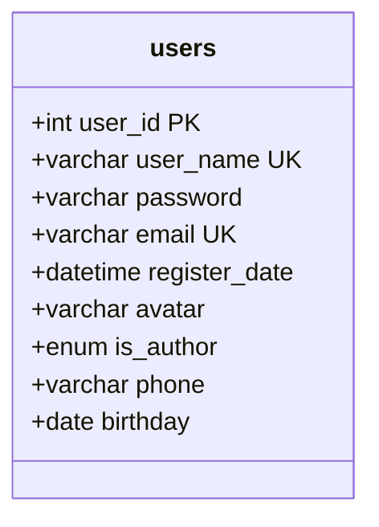
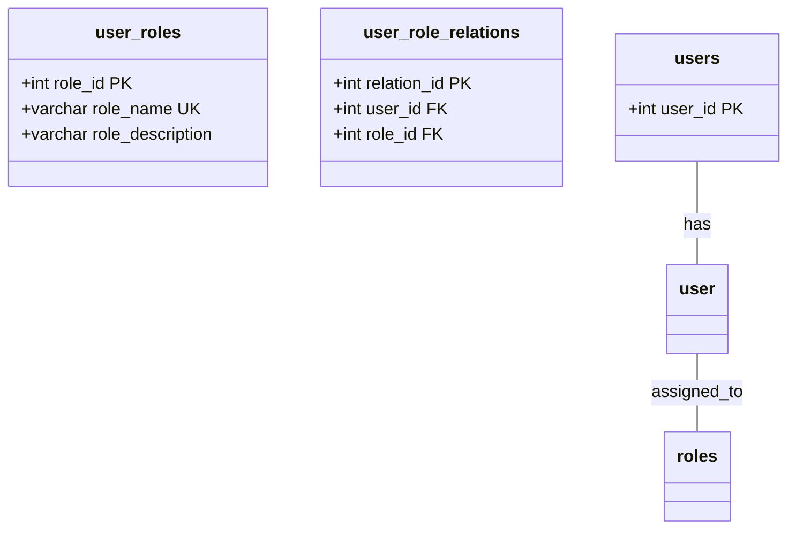
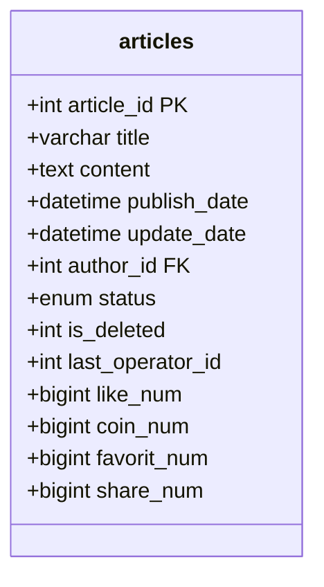
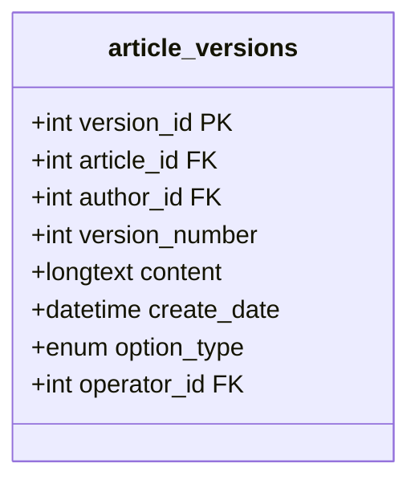
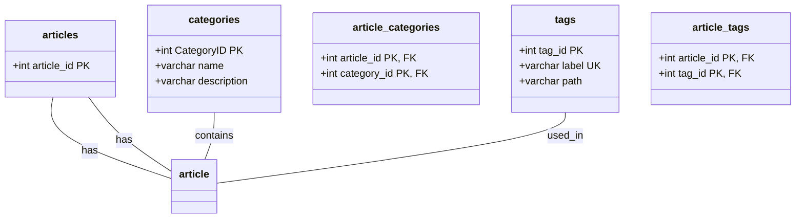
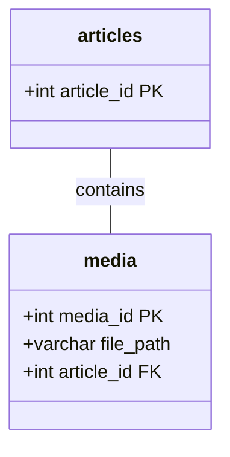
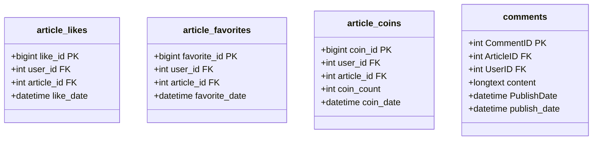
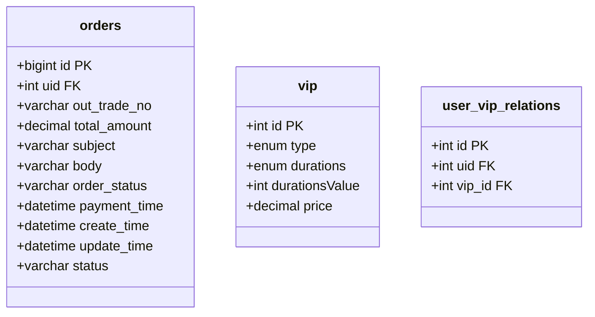
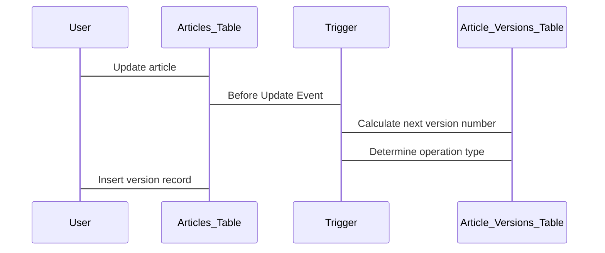

# Database Design

> **Relevant source files**
> * [MySQL/seunews.sql](https://github.com/zsqgleRoy/SEUNews/blob/9be5e28c/MySQL/seunews.sql)

## Purpose and Scope

This document describes the database design of the SEU News system, including the database schema, entity relationships, and key database features. It covers the MySQL database structure that supports all core functionality of the news platform including user management, article content, user interactions, and payment processing.

For information about how the database is accessed from the backend implementation, see [Backend Implementation](/zsqgleRoy/SEUNews/4-backend-implementation).

Sources: [MySQL/seunews.sql L1-L16](https://github.com/zsqgleRoy/SEUNews/blob/9be5e28c/MySQL/seunews.sql#L1-L16)

## Database Schema Overview

The SEU News database consists of 21 tables organized into several functional groups:

1. **User Management**: Tables for managing user accounts, roles, and VIP subscriptions
2. **Content Management**: Tables for articles, categories, tags, and media attachments
3. **User Interactions**: Tables for tracking likes, favorites, comments, and coin contributions
4. **Version Control**: Tables for tracking article version history
5. **Payment Processing**: Tables for handling orders and payment records
6. **System Logging**: Tables for tracking data operations

The database uses the InnoDB storage engine with UTF-8 encoding to support multilingual content and maintains referential integrity through foreign key constraints.

Sources: [MySQL/seunews.sql L17-L19](https://github.com/zsqgleRoy/SEUNews/blob/9be5e28c/MySQL/seunews.sql#L17-L19)

## Entity Relationship Diagram

The following diagram illustrates the relationships between the main entities in the SEU News database:

```
#mermaid-e0n80c90o4k{font-family:ui-sans-serif,-apple-system,system-ui,Segoe UI,Helvetica;font-size:16px;fill:#333;}@keyframes edge-animation-frame{from{stroke-dashoffset:0;}}@keyframes dash{to{stroke-dashoffset:0;}}#mermaid-e0n80c90o4k .edge-animation-slow{stroke-dasharray:9,5!important;stroke-dashoffset:900;animation:dash 50s linear infinite;stroke-linecap:round;}#mermaid-e0n80c90o4k .edge-animation-fast{stroke-dasharray:9,5!important;stroke-dashoffset:900;animation:dash 20s linear infinite;stroke-linecap:round;}#mermaid-e0n80c90o4k .error-icon{fill:#dddddd;}#mermaid-e0n80c90o4k .error-text{fill:#222222;stroke:#222222;}#mermaid-e0n80c90o4k .edge-thickness-normal{stroke-width:1px;}#mermaid-e0n80c90o4k .edge-thickness-thick{stroke-width:3.5px;}#mermaid-e0n80c90o4k .edge-pattern-solid{stroke-dasharray:0;}#mermaid-e0n80c90o4k .edge-thickness-invisible{stroke-width:0;fill:none;}#mermaid-e0n80c90o4k .edge-pattern-dashed{stroke-dasharray:3;}#mermaid-e0n80c90o4k .edge-pattern-dotted{stroke-dasharray:2;}#mermaid-e0n80c90o4k .marker{fill:#999;stroke:#999;}#mermaid-e0n80c90o4k .marker.cross{stroke:#999;}#mermaid-e0n80c90o4k svg{font-family:ui-sans-serif,-apple-system,system-ui,Segoe UI,Helvetica;font-size:16px;}#mermaid-e0n80c90o4k p{margin:0;}#mermaid-e0n80c90o4k .entityBox{fill:#ffffff;stroke:#dddddd;}#mermaid-e0n80c90o4k .relationshipLabelBox{fill:#dddddd;opacity:0.7;background-color:#dddddd;}#mermaid-e0n80c90o4k .relationshipLabelBox rect{opacity:0.5;}#mermaid-e0n80c90o4k .labelBkg{background-color:rgba(221, 221, 221, 0.5);}#mermaid-e0n80c90o4k .edgeLabel .label{fill:#dddddd;font-size:14px;}#mermaid-e0n80c90o4k .label{font-family:ui-sans-serif,-apple-system,system-ui,Segoe UI,Helvetica;color:#333;}#mermaid-e0n80c90o4k .edge-pattern-dashed{stroke-dasharray:8,8;}#mermaid-e0n80c90o4k .node rect,#mermaid-e0n80c90o4k .node circle,#mermaid-e0n80c90o4k .node ellipse,#mermaid-e0n80c90o4k .node polygon{fill:#ffffff;stroke:#dddddd;stroke-width:1px;}#mermaid-e0n80c90o4k .relationshipLine{stroke:#999;stroke-width:1;fill:none;}#mermaid-e0n80c90o4k .marker{fill:none!important;stroke:#999!important;stroke-width:1;}#mermaid-e0n80c90o4k :root{--mermaid-font-family:"trebuchet ms",verdana,arial,sans-serif;}authorsgivescreatesgiveswriteshassubscribes_toplacesparticipates_intracks_changesbelongs_tohascontainsreceivesreceivesreceiveshascategorizestagsassigned_topurchased_byusersarticlesarticle_likesarticle_favoritesarticle_coinscommentsuser_role_relationsuser_vip_relationsorderschat_recordsarticle_versionsarticle_categoriesarticle_tagsmediacategoriestagsuser_rolesvip
```

Sources: [MySQL/seunews.sql L20-L590](https://github.com/zsqgleRoy/SEUNews/blob/9be5e28c/MySQL/seunews.sql#L20-L590)

## Core Tables and Their Structure

### User Management Tables

The user management system consists of several tables to handle user accounts, roles, and VIP subscriptions.

#### Users Table

The `users` table is the central component storing user account information. Each user can be identified by a unique ID, username, or email.



Key features:

* `user_id`: Auto-incremented primary key
* `user_name`: Unique identifier for the user
* `email`: Unique email address for account recovery
* `is_author`: Enum field ('TRUE'/'FALSE') indicating if the user has author privileges

Sources: [MySQL/seunews.sql L535-L549](https://github.com/zsqgleRoy/SEUNews/blob/9be5e28c/MySQL/seunews.sql#L535-L549)

#### User Roles

The role system uses three tables to implement a flexible permission model:



This design allows users to have multiple roles, with predefined roles including:

* Ordinary User: Basic read access
* Paid User: Access to premium content
* Author: Content creation privileges

Sources: [MySQL/seunews.sql L477-L511](https://github.com/zsqgleRoy/SEUNews/blob/9be5e28c/MySQL/seunews.sql#L477-L511)

### Content Management Tables

#### Articles Table

The `articles` table is the core of the content management system, storing all article content and metadata.



Key features:

* `article_id`: Auto-incremented primary key
* `status`: Enum field ('DRAFT'/'PUBLISHED') indicating article status
* `is_deleted`: Soft delete flag (1 for deleted, 0 for active)
* Counters for likes, coins, favorites, and shares

Sources: [MySQL/seunews.sql L170-L189](https://github.com/zsqgleRoy/SEUNews/blob/9be5e28c/MySQL/seunews.sql#L170-L189)

#### Versioning System

Articles maintain a version history through the `article_versions` table:



A database trigger `tf_articles_version` automatically creates new version entries when articles are updated:

1. The trigger fires before an update on the `articles` table
2. It determines the operation type (DELETE, RESTORE, UPDATE_TITLE, UPDATE_CONTENT, UPDATE_BOTH)
3. It records the previous state of the article in the `article_versions` table

Sources: [MySQL/seunews.sql L145-L162](https://github.com/zsqgleRoy/SEUNews/blob/9be5e28c/MySQL/seunews.sql#L145-L162)

 [MySQL/seunews.sql L616-L663](https://github.com/zsqgleRoy/SEUNews/blob/9be5e28c/MySQL/seunews.sql#L616-L663)

#### Categories and Tags

Articles are organized using categories and tags, implemented with junction tables:



This many-to-many relationship allows:

* Articles to belong to multiple categories
* Articles to have multiple tags
* Tags to be reused across multiple articles

Sources: [MySQL/seunews.sql L24-L31](https://github.com/zsqgleRoy/SEUNews/blob/9be5e28c/MySQL/seunews.sql#L24-L31)

 [MySQL/seunews.sql L122-L129](https://github.com/zsqgleRoy/SEUNews/blob/9be5e28c/MySQL/seunews.sql#L122-L129)

 [MySQL/seunews.sql L220-L225](https://github.com/zsqgleRoy/SEUNews/blob/9be5e28c/MySQL/seunews.sql#L220-L225)

 [MySQL/seunews.sql L454-L460](https://github.com/zsqgleRoy/SEUNews/blob/9be5e28c/MySQL/seunews.sql#L454-L460)

#### Media Attachments

Articles can contain media files (images, videos, etc.) through the `media` table:



Sources: [MySQL/seunews.sql L336-L343](https://github.com/zsqgleRoy/SEUNews/blob/9be5e28c/MySQL/seunews.sql#L336-L343)

### User Interaction Tables

The system tracks various user interactions with articles:



Each interaction table has:

* A unique constraint on user_id and article_id pairs (for likes and favorites) to prevent duplicates
* Timestamps to track when the interaction occurred

Sources: [MySQL/seunews.sql L84-L95](https://github.com/zsqgleRoy/SEUNews/blob/9be5e28c/MySQL/seunews.sql#L84-L95)

 [MySQL/seunews.sql L63-L73](https://github.com/zsqgleRoy/SEUNews/blob/9be5e28c/MySQL/seunews.sql#L63-L73)

 [MySQL/seunews.sql L42-L53](https://github.com/zsqgleRoy/SEUNews/blob/9be5e28c/MySQL/seunews.sql#L42-L53)

 [MySQL/seunews.sql L294-L306](https://github.com/zsqgleRoy/SEUNews/blob/9be5e28c/MySQL/seunews.sql#L294-L306)

### Payment System Tables

The payment system uses the `orders` and `vip` tables:



This structure supports:

* Order processing and payment tracking
* Different VIP subscription types and durations
* Mapping users to their purchased VIP plans

Sources: [MySQL/seunews.sql L374-L389](https://github.com/zsqgleRoy/SEUNews/blob/9be5e28c/MySQL/seunews.sql#L374-L389)

 [MySQL/seunews.sql L574-L583](https://github.com/zsqgleRoy/SEUNews/blob/9be5e28c/MySQL/seunews.sql#L574-L583)

 [MySQL/seunews.sql L517-L526](https://github.com/zsqgleRoy/SEUNews/blob/9be5e28c/MySQL/seunews.sql#L517-L526)

## Database Indexes and Constraints

The database uses various indexes and constraints to ensure data integrity and optimize performance:

### Primary Keys

All tables have primary keys, typically using auto-incrementing integers.

### Foreign Keys

Foreign key constraints maintain referential integrity between related tables:

* Articles reference authors (users)
* Interactions (likes, favorites, coins) reference both users and articles
* Junction tables (article_categories, article_tags) reference their respective entities

### Unique Constraints

Several tables implement unique constraints:

* `users` table: username and email
* `tags` table: label
* `user_roles` table: role_name
* Interaction tables: prevent duplicate user interactions with the same article

### Indexes

The database uses various indexes to optimize query performance:

* Foreign key columns are indexed
* Columns frequently used in WHERE clauses
* Columns used for sorting
* Compound indexes for junction tables

Sources: [MySQL/seunews.sql L20-L590](https://github.com/zsqgleRoy/SEUNews/blob/9be5e28c/MySQL/seunews.sql#L20-L590)

## Stored Procedures and Triggers

### Stored Procedures

The database includes a stored procedure for handling article deletion:

```
sp_delete_article(p_article_id INT, p_operator_id INT)
```

This procedure performs a soft delete by setting the `is_deleted` flag to 1 and recording the operator who performed the deletion.

Sources: [MySQL/seunews.sql L592-L611](https://github.com/zsqgleRoy/SEUNews/blob/9be5e28c/MySQL/seunews.sql#L592-L611)

### Triggers

The `tf_articles_version` trigger automatically tracks article versions:



Operation types tracked by the trigger:

* DELETE: Article is soft-deleted
* RESTORE: Article is restored from deleted state
* UPDATE_TITLE: Only the title is changed
* UPDATE_CONTENT: Only the content is changed
* UPDATE_BOTH: Both title and content are changed

Sources: [MySQL/seunews.sql L616-L663](https://github.com/zsqgleRoy/SEUNews/blob/9be5e28c/MySQL/seunews.sql#L616-L663)

## Schema Evolution and Maintenance

The database schema includes provisions for tracking changes and maintaining data integrity:

1. **Soft Deletion**: Articles are never physically deleted from the database, only marked as deleted using the `is_deleted` flag
2. **Version History**: All changes to articles are tracked in the `article_versions` table
3. **Operator Tracking**: The system records which user made each change
4. **Data Operation Logs**: The `data_operation_logs` table can track INSERT, UPDATE, and DELETE operations across tables

These features support auditability and potential rollback of changes if needed.

Sources: [MySQL/seunews.sql L315-L326](https://github.com/zsqgleRoy/SEUNews/blob/9be5e28c/MySQL/seunews.sql#L315-L326)

## Table Relationships Summary

The following table summarizes the key relationships in the database:

| Parent Entity | Relationship | Child Entity | Description |
| --- | --- | --- | --- |
| users | one-to-many | articles | Users can author multiple articles |
| users | one-to-many | article_likes | Users can like multiple articles |
| users | one-to-many | article_favorites | Users can favorite multiple articles |
| users | one-to-many | article_coins | Users can give coins to multiple articles |
| users | one-to-many | comments | Users can comment on multiple articles |
| users | one-to-many | orders | Users can place multiple orders |
| articles | one-to-many | article_versions | Articles can have multiple versions |
| articles | many-to-many | categories | Articles can belong to multiple categories |
| articles | many-to-many | tags | Articles can have multiple tags |
| articles | one-to-many | media | Articles can contain multiple media files |

Sources: [MySQL/seunews.sql L20-L590](https://github.com/zsqgleRoy/SEUNews/blob/9be5e28c/MySQL/seunews.sql#L20-L590)