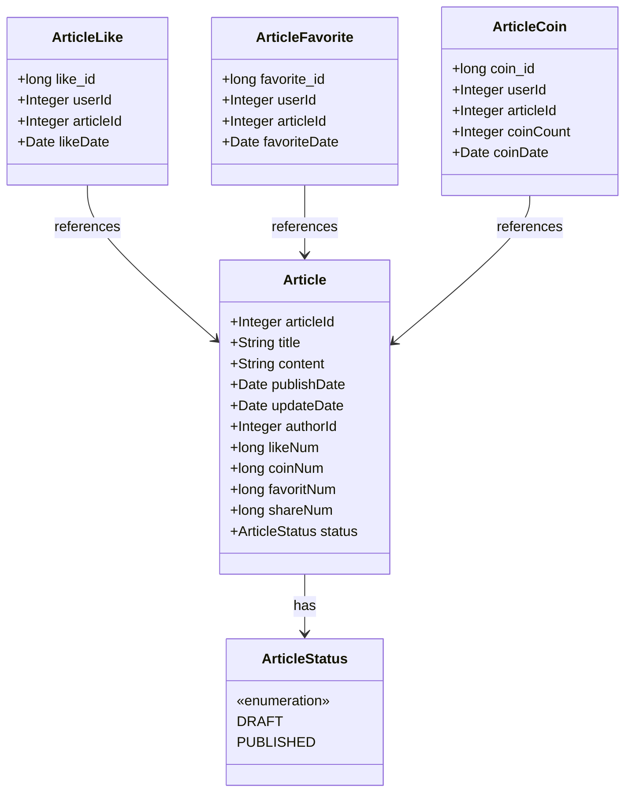

# Entity Model

> **Relevant source files**
> * [SEUNewsWebsite/src/main/java/com/royzhang/seunewswebsite/entity/Article.java](https://github.com/zsqgleRoy/SEUNews/blob/9be5e28c/SEUNewsWebsite/src/main/java/com/royzhang/seunewswebsite/entity/Article.java)
> * [SEUNewsWebsite/src/main/java/com/royzhang/seunewswebsite/entity/ArticleCoin.java](https://github.com/zsqgleRoy/SEUNews/blob/9be5e28c/SEUNewsWebsite/src/main/java/com/royzhang/seunewswebsite/entity/ArticleCoin.java)
> * [SEUNewsWebsite/src/main/java/com/royzhang/seunewswebsite/entity/ArticleFavorite.java](https://github.com/zsqgleRoy/SEUNews/blob/9be5e28c/SEUNewsWebsite/src/main/java/com/royzhang/seunewswebsite/entity/ArticleFavorite.java)
> * [SEUNewsWebsite/src/main/java/com/royzhang/seunewswebsite/entity/ArticleLike.java](https://github.com/zsqgleRoy/SEUNews/blob/9be5e28c/SEUNewsWebsite/src/main/java/com/royzhang/seunewswebsite/entity/ArticleLike.java)

## Purpose and Scope

This document describes the core entity model classes in the SEUNews system that represent the domain objects. These entities are mapped to database tables using JPA (Java Persistence API) annotations and form the foundation of the application's data layer. This page focuses on the structure and relationships of these entity classes. For information about Data Transfer Objects (DTOs) that are used to transfer data between layers, see [Data Transfer Objects](/zsqgleRoy/SEUNews/4.3-data-transfer-objects).

## Overview of Entity Classes

The SEUNews system is built around several key entity classes representing core domain concepts, with the Article entity being central. The entity classes use JPA annotations to map between Java objects and database tables.



Sources:

* [SEUNewsWebsite/src/main/java/com/royzhang/seunewswebsite/entity/Article.java L18-L56](https://github.com/zsqgleRoy/SEUNews/blob/9be5e28c/SEUNewsWebsite/src/main/java/com/royzhang/seunewswebsite/entity/Article.java#L18-L56)
* [SEUNewsWebsite/src/main/java/com/royzhang/seunewswebsite/entity/ArticleLike.java L13-L31](https://github.com/zsqgleRoy/SEUNews/blob/9be5e28c/SEUNewsWebsite/src/main/java/com/royzhang/seunewswebsite/entity/ArticleLike.java#L13-L31)
* [SEUNewsWebsite/src/main/java/com/royzhang/seunewswebsite/entity/ArticleFavorite.java L13-L31](https://github.com/zsqgleRoy/SEUNews/blob/9be5e28c/SEUNewsWebsite/src/main/java/com/royzhang/seunewswebsite/entity/ArticleFavorite.java#L13-L31)
* [SEUNewsWebsite/src/main/java/com/royzhang/seunewswebsite/entity/ArticleCoin.java L13-L34](https://github.com/zsqgleRoy/SEUNews/blob/9be5e28c/SEUNewsWebsite/src/main/java/com/royzhang/seunewswebsite/entity/ArticleCoin.java#L13-L34)

## Article Entity

The `Article` entity is the central domain object in the system, representing news articles. It maps to the `articles` table in the database.

### Key Attributes

| Attribute | Type | Description | JPA Annotations |
| --- | --- | --- | --- |
| articleId | Integer | Primary key / article identifier | `@Id`, `@GeneratedValue` |
| title | String | Article title | `@Column(name = "title")` |
| content | String | Article content (HTML/text) | `@Column(columnDefinition = "Text")` |
| publishDate | Date | Date when article was published | `@Column(name = "publish_date")` |
| updateDate | Date | Date when article was last updated | `@Column(name = "update_date")` |
| authorId | Integer | Foreign key reference to the article author | `@Column(name = "author_id")` |
| likeNum | long | Count of likes received by the article | `@Column(name = "like_num")` |
| coinNum | long | Count of coins given to the article | `@Column(name = "coin_num")` |
| favoritNum | long | Count of users who favorited the article | `@Column(name = "favorit_num")` |
| shareNum | long | Count of article shares | `@Column(name = "share_num")` |
| status | ArticleStatus | Article publication status (DRAFT/PUBLISHED) | `@Enumerated(EnumType.STRING)` |

The `Article` class also contains an inner enum `ArticleStatus` with values `DRAFT` and `PUBLISHED` to represent the article's current publication state.

Sources:

* [SEUNewsWebsite/src/main/java/com/royzhang/seunewswebsite/entity/Article.java L18-L56](https://github.com/zsqgleRoy/SEUNews/blob/9be5e28c/SEUNewsWebsite/src/main/java/com/royzhang/seunewswebsite/entity/Article.java#L18-L56)

## Article Interaction Entities

The system includes three entity classes that represent different ways users can interact with articles.

### ArticleLike Entity

The `ArticleLike` entity represents a user's action of liking an article. It maps to the `article_likes` table.

| Attribute | Type | Description | JPA Annotations |
| --- | --- | --- | --- |
| like_id | long | Primary key | `@Id`, `@GeneratedValue` |
| userId | Integer | Foreign key reference to the user | `@Column(name = "user_id")` |
| articleId | Integer | Foreign key reference to the article | `@Column(name = "article_id")` |
| likeDate | Date | Timestamp when the like was recorded | `@Column(name = "like_date")` |

Sources:

* [SEUNewsWebsite/src/main/java/com/royzhang/seunewswebsite/entity/ArticleLike.java L13-L31](https://github.com/zsqgleRoy/SEUNews/blob/9be5e28c/SEUNewsWebsite/src/main/java/com/royzhang/seunewswebsite/entity/ArticleLike.java#L13-L31)

### ArticleFavorite Entity

The `ArticleFavorite` entity represents a user favoriting (bookmarking) an article. It maps to the `article_favorites` table.

| Attribute | Type | Description | JPA Annotations |
| --- | --- | --- | --- |
| favorite_id | long | Primary key | `@Id`, `@GeneratedValue` |
| userId | Integer | Foreign key reference to the user | `@Column(name = "user_id")` |
| articleId | Integer | Foreign key reference to the article | `@Column(name = "article_id")` |
| favoriteDate | Date | Timestamp when the favorite was recorded | `@Column(name = "favorite_date")` |

Sources:

* [SEUNewsWebsite/src/main/java/com/royzhang/seunewswebsite/entity/ArticleFavorite.java L13-L31](https://github.com/zsqgleRoy/SEUNews/blob/9be5e28c/SEUNewsWebsite/src/main/java/com/royzhang/seunewswebsite/entity/ArticleFavorite.java#L13-L31)

### ArticleCoin Entity

The `ArticleCoin` entity represents a user contributing digital coins to an article (a form of appreciation or donation). It maps to the `article_coins` table.

| Attribute | Type | Description | JPA Annotations |
| --- | --- | --- | --- |
| coin_id | long | Primary key | `@Id`, `@GeneratedValue` |
| userId | Integer | Foreign key reference to the user | `@Column(name = "user_id")` |
| articleId | Integer | Foreign key reference to the article | `@Column(name = "article_id")` |
| coinCount | Integer | Number of coins contributed | `@Column(name = "coin_count")` |
| coinDate | Date | Timestamp when coins were contributed | `@Column(name = "coin_date")` |

Sources:

* [SEUNewsWebsite/src/main/java/com/royzhang/seunewswebsite/entity/ArticleCoin.java L13-L34](https://github.com/zsqgleRoy/SEUNews/blob/9be5e28c/SEUNewsWebsite/src/main/java/com/royzhang/seunewswebsite/entity/ArticleCoin.java#L13-L34)

## Entity Relationships

The diagram below illustrates the relationships between entities in the system and their mapping to database tables.

```

```

Sources:

* [SEUNewsWebsite/src/main/java/com/royzhang/seunewswebsite/entity/Article.java L13-L56](https://github.com/zsqgleRoy/SEUNews/blob/9be5e28c/SEUNewsWebsite/src/main/java/com/royzhang/seunewswebsite/entity/Article.java#L13-L56)
* [SEUNewsWebsite/src/main/java/com/royzhang/seunewswebsite/entity/ArticleLike.java L11-L31](https://github.com/zsqgleRoy/SEUNews/blob/9be5e28c/SEUNewsWebsite/src/main/java/com/royzhang/seunewswebsite/entity/ArticleLike.java#L11-L31)
* [SEUNewsWebsite/src/main/java/com/royzhang/seunewswebsite/entity/ArticleFavorite.java L11-L31](https://github.com/zsqgleRoy/SEUNews/blob/9be5e28c/SEUNewsWebsite/src/main/java/com/royzhang/seunewswebsite/entity/ArticleFavorite.java#L11-L31)
* [SEUNewsWebsite/src/main/java/com/royzhang/seunewswebsite/entity/ArticleCoin.java L11-L34](https://github.com/zsqgleRoy/SEUNews/blob/9be5e28c/SEUNewsWebsite/src/main/java/com/royzhang/seunewswebsite/entity/ArticleCoin.java#L11-L34)

## JPA Annotations Used

The entity model classes use various JPA annotations to map Java objects to database tables:

| Annotation | Purpose |
| --- | --- |
| `@Entity` | Marks a class as a JPA entity (database table) |
| `@Table(name = "...")` | Specifies the database table name |
| `@Id` | Designates a field as the primary key |
| `@GeneratedValue` | Configures primary key generation strategy |
| `@Column(name = "...")` | Maps a field to a specific database column |
| `@Column(columnDefinition = "...")` | Specifies SQL column type |
| `@Enumerated(EnumType.STRING)` | Maps Java enum to database string value |

Most entities also use Lombok annotations (`@Data`, `@Getter`, `@Setter`, `@NoArgsConstructor`, `@AllArgsConstructor`) to reduce boilerplate code by automatically generating constructors, getters, setters, and common methods.

Sources:

* [SEUNewsWebsite/src/main/java/com/royzhang/seunewswebsite/entity/Article.java L9-L18](https://github.com/zsqgleRoy/SEUNews/blob/9be5e28c/SEUNewsWebsite/src/main/java/com/royzhang/seunewswebsite/entity/Article.java#L9-L18)
* [SEUNewsWebsite/src/main/java/com/royzhang/seunewswebsite/entity/ArticleLike.java L3-L12](https://github.com/zsqgleRoy/SEUNews/blob/9be5e28c/SEUNewsWebsite/src/main/java/com/royzhang/seunewswebsite/entity/ArticleLike.java#L3-L12)
* [SEUNewsWebsite/src/main/java/com/royzhang/seunewswebsite/entity/ArticleFavorite.java L3-L12](https://github.com/zsqgleRoy/SEUNews/blob/9be5e28c/SEUNewsWebsite/src/main/java/com/royzhang/seunewswebsite/entity/ArticleFavorite.java#L3-L12)
* [SEUNewsWebsite/src/main/java/com/royzhang/seunewswebsite/entity/ArticleCoin.java L3-L12](https://github.com/zsqgleRoy/SEUNews/blob/9be5e28c/SEUNewsWebsite/src/main/java/com/royzhang/seunewswebsite/entity/ArticleCoin.java#L3-L12)

## Noteworthy Design Elements

* **Counter Fields**: The Article entity includes counter fields (likeNum, coinNum, favoritNum, shareNum) to track aggregate statistics without having to perform expensive JOIN operations.
* **Status Enum**: Article status is tracked using an enum rather than arbitrary strings, ensuring data consistency.
* **Timestamps**: All interaction entities (like, favorite, coin) include date fields to track when the action occurred.
* **Simple References**: Entities use simple foreign key references (userId, articleId) rather than JPA relationship mappings, suggesting a performance-focused design.

Sources:

* [SEUNewsWebsite/src/main/java/com/royzhang/seunewswebsite/entity/Article.java L38-L48](https://github.com/zsqgleRoy/SEUNews/blob/9be5e28c/SEUNewsWebsite/src/main/java/com/royzhang/seunewswebsite/entity/Article.java#L38-L48)
* [SEUNewsWebsite/src/main/java/com/royzhang/seunewswebsite/entity/Article.java L50-L55](https://github.com/zsqgleRoy/SEUNews/blob/9be5e28c/SEUNewsWebsite/src/main/java/com/royzhang/seunewswebsite/entity/Article.java#L50-L55)
* [SEUNewsWebsite/src/main/java/com/royzhang/seunewswebsite/entity/ArticleLike.java L24-L25](https://github.com/zsqgleRoy/SEUNews/blob/9be5e28c/SEUNewsWebsite/src/main/java/com/royzhang/seunewswebsite/entity/ArticleLike.java#L24-L25)
* [SEUNewsWebsite/src/main/java/com/royzhang/seunewswebsite/entity/ArticleFavorite.java L24-L25](https://github.com/zsqgleRoy/SEUNews/blob/9be5e28c/SEUNewsWebsite/src/main/java/com/royzhang/seunewswebsite/entity/ArticleFavorite.java#L24-L25)
* [SEUNewsWebsite/src/main/java/com/royzhang/seunewswebsite/entity/ArticleCoin.java L24-L28](https://github.com/zsqgleRoy/SEUNews/blob/9be5e28c/SEUNewsWebsite/src/main/java/com/royzhang/seunewswebsite/entity/ArticleCoin.java#L24-L28)