# Entity Relationships

> **Relevant source files**
> * [MySQL/seunews.sql](https://github.com/zsqgleRoy/SEUNews/blob/9be5e28c/MySQL/seunews.sql)
> * [SEUNewsWebsite/src/main/java/com/royzhang/seunewswebsite/entity/Article.java](https://github.com/zsqgleRoy/SEUNews/blob/9be5e28c/SEUNewsWebsite/src/main/java/com/royzhang/seunewswebsite/entity/Article.java)
> * [SEUNewsWebsite/src/main/java/com/royzhang/seunewswebsite/entity/ArticleCoin.java](https://github.com/zsqgleRoy/SEUNews/blob/9be5e28c/SEUNewsWebsite/src/main/java/com/royzhang/seunewswebsite/entity/ArticleCoin.java)
> * [SEUNewsWebsite/src/main/java/com/royzhang/seunewswebsite/entity/ArticleFavorite.java](https://github.com/zsqgleRoy/SEUNews/blob/9be5e28c/SEUNewsWebsite/src/main/java/com/royzhang/seunewswebsite/entity/ArticleFavorite.java)
> * [SEUNewsWebsite/src/main/java/com/royzhang/seunewswebsite/entity/ArticleLike.java](https://github.com/zsqgleRoy/SEUNews/blob/9be5e28c/SEUNewsWebsite/src/main/java/com/royzhang/seunewswebsite/entity/ArticleLike.java)

This document provides detailed information about the database entity relationships in the SEUNews system. It focuses on the structure, organization, and interconnections between database tables and their corresponding Java entity classes.

For information about the overall database schema design, see [Database Design](/zsqgleRoy/SEUNews/3-database-design).

## Core Domain Model

The SEUNews system is built around a central `Article` entity, with various related entities that support features like user interactions, categorization, and media management.

```

```

Sources:

* [MySQL/seunews.sql L170-L189](https://github.com/zsqgleRoy/SEUNews/blob/9be5e28c/MySQL/seunews.sql#L170-L189)
* [SEUNewsWebsite/src/main/java/com/royzhang/seunewswebsite/entity/Article.java L13-L56](https://github.com/zsqgleRoy/SEUNews/blob/9be5e28c/SEUNewsWebsite/src/main/java/com/royzhang/seunewswebsite/entity/Article.java#L13-L56)

## Database Relationships

The following diagram shows the detailed entity relationships in the database schema:

```
#mermaid-uu94xx562pe{font-family:ui-sans-serif,-apple-system,system-ui,Segoe UI,Helvetica;font-size:16px;fill:#333;}@keyframes edge-animation-frame{from{stroke-dashoffset:0;}}@keyframes dash{to{stroke-dashoffset:0;}}#mermaid-uu94xx562pe .edge-animation-slow{stroke-dasharray:9,5!important;stroke-dashoffset:900;animation:dash 50s linear infinite;stroke-linecap:round;}#mermaid-uu94xx562pe .edge-animation-fast{stroke-dasharray:9,5!important;stroke-dashoffset:900;animation:dash 20s linear infinite;stroke-linecap:round;}#mermaid-uu94xx562pe .error-icon{fill:#dddddd;}#mermaid-uu94xx562pe .error-text{fill:#222222;stroke:#222222;}#mermaid-uu94xx562pe .edge-thickness-normal{stroke-width:1px;}#mermaid-uu94xx562pe .edge-thickness-thick{stroke-width:3.5px;}#mermaid-uu94xx562pe .edge-pattern-solid{stroke-dasharray:0;}#mermaid-uu94xx562pe .edge-thickness-invisible{stroke-width:0;fill:none;}#mermaid-uu94xx562pe .edge-pattern-dashed{stroke-dasharray:3;}#mermaid-uu94xx562pe .edge-pattern-dotted{stroke-dasharray:2;}#mermaid-uu94xx562pe .marker{fill:#999;stroke:#999;}#mermaid-uu94xx562pe .marker.cross{stroke:#999;}#mermaid-uu94xx562pe svg{font-family:ui-sans-serif,-apple-system,system-ui,Segoe UI,Helvetica;font-size:16px;}#mermaid-uu94xx562pe p{margin:0;}#mermaid-uu94xx562pe .entityBox{fill:#ffffff;stroke:#dddddd;}#mermaid-uu94xx562pe .relationshipLabelBox{fill:#dddddd;opacity:0.7;background-color:#dddddd;}#mermaid-uu94xx562pe .relationshipLabelBox rect{opacity:0.5;}#mermaid-uu94xx562pe .labelBkg{background-color:rgba(221, 221, 221, 0.5);}#mermaid-uu94xx562pe .edgeLabel .label{fill:#dddddd;font-size:14px;}#mermaid-uu94xx562pe .label{font-family:ui-sans-serif,-apple-system,system-ui,Segoe UI,Helvetica;color:#333;}#mermaid-uu94xx562pe .edge-pattern-dashed{stroke-dasharray:8,8;}#mermaid-uu94xx562pe .node rect,#mermaid-uu94xx562pe .node circle,#mermaid-uu94xx562pe .node ellipse,#mermaid-uu94xx562pe .node polygon{fill:#ffffff;stroke:#dddddd;stroke-width:1px;}#mermaid-uu94xx562pe .relationshipLine{stroke:#999;stroke-width:1;fill:none;}#mermaid-uu94xx562pe .marker{fill:none!important;stroke:#999!important;stroke-width:1;}#mermaid-uu94xx562pe :root{--mermaid-font-family:"trebuchet ms",verdana,arial,sans-serif;}receivesreceivesreceivesbelongs_tohashascontainstracks_changesauthorsgivescreatesgiveswritesparticipates_incategorizestagsARTICLESintarticle_idPKvarchartitletextcontentdatetimepublish_datedatetimeupdate_dateintauthor_idFKenumstatusintis_deletedintlast_operator_idbigintlike_numbigintcoin_numbigintfavorit_numbigintshare_numARTICLE_LIKESbigintlike_idPKintuser_idFKintarticle_idFKdatetimelike_dateARTICLE_FAVORITESbigintfavorite_idPKintuser_idFKintarticle_idFKdatetimefavorite_dateARTICLE_COINSbigintcoin_idPKintuser_idFKintarticle_idFKintcoin_countdatetimecoin_dateARTICLE_CATEGORIESintarticle_idPK,FKintcategory_idPK,FKARTICLE_TAGSintarticle_idPK,FKinttag_idPK,FKCOMMENTSintCommentIDPKintArticleIDFKintUserIDFKlongtextcontentdatetimePublishDateMEDIAintmedia_idPKvarcharfile_pathintarticle_idFKARTICLE_VERSIONSintversion_idPKintarticle_idFKintauthor_idFKintversion_numberlongtextcontentdatetimecreate_dateenumoption_typeintoperator_idFKUSERSintuser_idPKvarcharuser_namevarcharpasswordvarcharemailenumis_authorvarcharavatarCHAT_RECORDSintidPKtextcontentvarcharrolevarcharsession_iddatetimetimestampintuser_idFKCATEGORIESintCategoryIDPKvarcharnamevarchardescriptionTAGSinttag_idPKvarcharname
```

Sources:

* [MySQL/seunews.sql L20-L343](https://github.com/zsqgleRoy/SEUNews/blob/9be5e28c/MySQL/seunews.sql#L20-L343)

## Entity to Code Mapping

This diagram illustrates how the database tables map to Java entity classes in the codebase:

```mermaid
flowchart TD

subgraph Java_Entity_Classes ["Java Entity Classes"]
end

subgraph Database_Tables ["Database Tables"]
end

DB_Articles["articles"]
DB_ArticleLikes["article_likes"]
DB_ArticleFavorites["article_favorites"]
DB_ArticleCoins["article_coins"]
Java_Article["Article.java"]
Java_ArticleLike["ArticleLike.java"]
Java_ArticleFavorite["ArticleFavorite.java"]
Java_ArticleCoin["ArticleCoin.java"]
```



Sources:

* [SEUNewsWebsite/src/main/java/com/royzhang/seunewswebsite/entity/Article.java L13-L56](https://github.com/zsqgleRoy/SEUNews/blob/9be5e28c/SEUNewsWebsite/src/main/java/com/royzhang/seunewswebsite/entity/Article.java#L13-L56)
* [SEUNewsWebsite/src/main/java/com/royzhang/seunewswebsite/entity/ArticleLike.java L9-L31](https://github.com/zsqgleRoy/SEUNews/blob/9be5e28c/SEUNewsWebsite/src/main/java/com/royzhang/seunewswebsite/entity/ArticleLike.java#L9-L31)
* [SEUNewsWebsite/src/main/java/com/royzhang/seunewswebsite/entity/ArticleFavorite.java L9-L31](https://github.com/zsqgleRoy/SEUNews/blob/9be5e28c/SEUNewsWebsite/src/main/java/com/royzhang/seunewswebsite/entity/ArticleFavorite.java#L9-L31)
* [SEUNewsWebsite/src/main/java/com/royzhang/seunewswebsite/entity/ArticleCoin.java L9-L33](https://github.com/zsqgleRoy/SEUNews/blob/9be5e28c/SEUNewsWebsite/src/main/java/com/royzhang/seunewswebsite/entity/ArticleCoin.java#L9-L33)

## Key Relationship Types

The SEUNews system employs several types of entity relationships:

### One-to-Many Relationships

| Primary Entity | Related Entity | Relationship Description |
| --- | --- | --- |
| Articles | ArticleLikes | An article can receive multiple likes from different users |
| Articles | ArticleFavorites | An article can be favorited by multiple users |
| Articles | ArticleCoins | An article can receive coins from multiple users |
| Articles | Comments | An article can have multiple comments |
| Articles | Media | An article can contain multiple media files |
| Users | Articles | A user can author multiple articles |
| Users | ArticleLikes | A user can like multiple articles |
| Users | ArticleFavorites | A user can favorite multiple articles |
| Users | ArticleCoins | A user can give coins to multiple articles |
| Users | Comments | A user can write multiple comments |

Sources:

* [MySQL/seunews.sql L28-L30](https://github.com/zsqgleRoy/SEUNews/blob/9be5e28c/MySQL/seunews.sql#L28-L30)

 - Article to Category foreign key
* [MySQL/seunews.sql L51-L52](https://github.com/zsqgleRoy/SEUNews/blob/9be5e28c/MySQL/seunews.sql#L51-L52)

 - ArticleCoin foreign keys
* [MySQL/seunews.sql L71-L72](https://github.com/zsqgleRoy/SEUNews/blob/9be5e28c/MySQL/seunews.sql#L71-L72)

 - ArticleFavorite foreign keys
* [MySQL/seunews.sql L93-L94](https://github.com/zsqgleRoy/SEUNews/blob/9be5e28c/MySQL/seunews.sql#L93-L94)

 - ArticleLike foreign keys

### Many-to-Many Relationships

| Entities | Junction Table | Relationship Description |
| --- | --- | --- |
| Articles & Categories | article_categories | An article can belong to multiple categories, and a category can contain multiple articles |
| Articles & Tags | article_tags | An article can have multiple tags, and a tag can be applied to multiple articles |

Sources:

* [MySQL/seunews.sql L20-L31](https://github.com/zsqgleRoy/SEUNews/blob/9be5e28c/MySQL/seunews.sql#L20-L31)

 - article_categories table
* [MySQL/seunews.sql L119-L129](https://github.com/zsqgleRoy/SEUNews/blob/9be5e28c/MySQL/seunews.sql#L119-L129)

 - article_tags table

## Article Interaction Entities

The system implements several entities for tracking user interactions with articles:

### ArticleLike

The `ArticleLike` entity represents a user liking an article:

```

```

Key constraints:

* A user can like an article only once (enforced by unique constraint on `user_id` and `article_id`)
* The `likeNum` in the `Article` entity tracks the total number of likes

Sources:

* [MySQL/seunews.sql L84-L95](https://github.com/zsqgleRoy/SEUNews/blob/9be5e28c/MySQL/seunews.sql#L84-L95)

 - article_likes table definition
* [SEUNewsWebsite/src/main/java/com/royzhang/seunewswebsite/entity/ArticleLike.java L9-L31](https://github.com/zsqgleRoy/SEUNews/blob/9be5e28c/SEUNewsWebsite/src/main/java/com/royzhang/seunewswebsite/entity/ArticleLike.java#L9-L31)

### ArticleFavorite

The `ArticleFavorite` entity represents a user favoriting/bookmarking an article:

```

```

Key constraints:

* A user can favorite an article only once (enforced by unique constraint on `user_id` and `article_id`)
* The `favoritNum` in the `Article` entity tracks the total number of favorites

Sources:

* [MySQL/seunews.sql L62-L73](https://github.com/zsqgleRoy/SEUNews/blob/9be5e28c/MySQL/seunews.sql#L62-L73)

 - article_favorites table definition
* [SEUNewsWebsite/src/main/java/com/royzhang/seunewswebsite/entity/ArticleFavorite.java L9-L31](https://github.com/zsqgleRoy/SEUNews/blob/9be5e28c/SEUNewsWebsite/src/main/java/com/royzhang/seunewswebsite/entity/ArticleFavorite.java#L9-L31)

### ArticleCoin

The `ArticleCoin` entity represents a user contributing coins to an article (likely a monetization feature):

```

```

Key features:

* A user can give multiple coins to an article (unlike likes and favorites)
* The `coinCount` field tracks how many coins were given in a single transaction
* The `coinNum` in the `Article` entity tracks the total number of coins received

Sources:

* [MySQL/seunews.sql L41-L53](https://github.com/zsqgleRoy/SEUNews/blob/9be5e28c/MySQL/seunews.sql#L41-L53)

 - article_coins table definition
* [SEUNewsWebsite/src/main/java/com/royzhang/seunewswebsite/entity/ArticleCoin.java L9-L33](https://github.com/zsqgleRoy/SEUNews/blob/9be5e28c/SEUNewsWebsite/src/main/java/com/royzhang/seunewswebsite/entity/ArticleCoin.java#L9-L33)

## Versioning and Content Management

The system implements article versioning through the `article_versions` table:

```

```

Key features:

* Each article can have multiple versions
* The system tracks who made changes and what kind of changes were made
* The `option_type` field categorizes the type of change: DELETE, RESTORE, UPDATE_TITLE, UPDATE_CONTENT, UPDATE_BOTH, or NONE

Sources:

* [MySQL/seunews.sql L145-L162](https://github.com/zsqgleRoy/SEUNews/blob/9be5e28c/MySQL/seunews.sql#L145-L162)

 - article_versions table definition

## Categorization and Tagging

Articles can be categorized and tagged through many-to-many relationships:

```

```

Key features:

* Junction tables (`article_categories` and `article_tags`) manage the many-to-many relationships
* Primary keys in these tables are composite keys of both foreign keys
* Constraints ensure referential integrity

Sources:

* [MySQL/seunews.sql L20-L31](https://github.com/zsqgleRoy/SEUNews/blob/9be5e28c/MySQL/seunews.sql#L20-L31)

 - article_categories table definition
* [MySQL/seunews.sql L119-L129](https://github.com/zsqgleRoy/SEUNews/blob/9be5e28c/MySQL/seunews.sql#L119-L129)

 - article_tags table definition

## Content and Media Management

Articles can contain media files through the `media` table:

```

```

Key features:

* Media files are stored as file paths
* Each media file is associated with a specific article

Sources:

* [MySQL/seunews.sql L335-L343](https://github.com/zsqgleRoy/SEUNews/blob/9be5e28c/MySQL/seunews.sql#L335-L343)

 - media table definition

## User Interactions and Comments

Users can interact with articles through comments:

```

```

Key features:

* Comments are linked to both articles and users
* The system tracks when comments were published

Sources:

* [MySQL/seunews.sql L293-L306](https://github.com/zsqgleRoy/SEUNews/blob/9be5e28c/MySQL/seunews.sql#L293-L306)

 - comments table definition