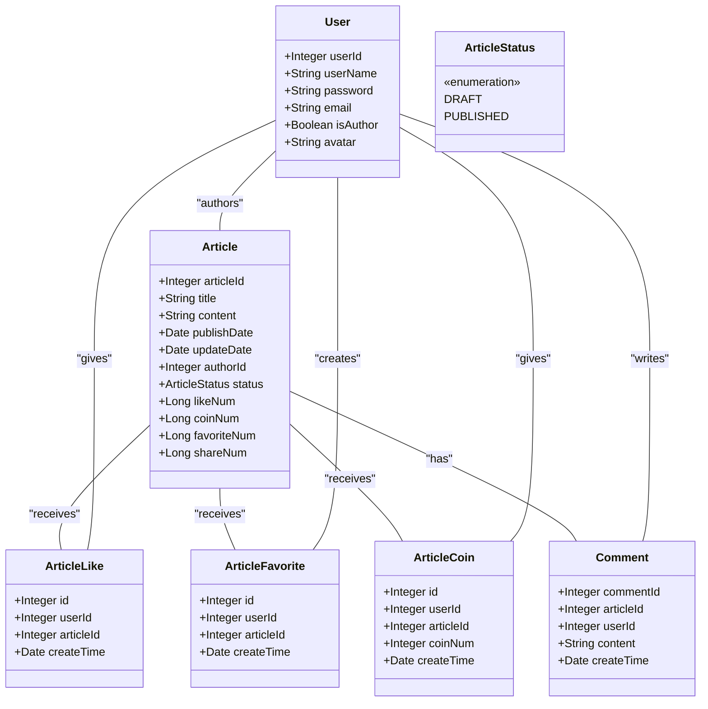
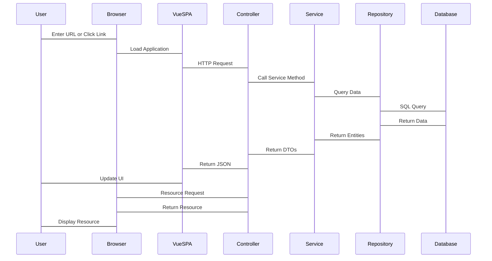

# Overview

> **Relevant source files**
> * [README.md](https://github.com/zsqgleRoy/SEUNews/blob/9be5e28c/README.md)

## Purpose and Scope

SEUNews is a comprehensive news website that allows users to read, author, and interact with news articles. Built with Vue3, TypeScript, and Spring Boot, the system provides a modern, responsive interface for accessing and managing news content with rich media support including images, videos, and audio files.

This overview introduces the key components and architecture of the SEUNews system. For more detailed information, see:

* [System Architecture](/zsqgleRoy/SEUNews/2-system-architecture)
* [Database Design](/zsqgleRoy/SEUNews/3-database-design)
* [Backend Implementation](/zsqgleRoy/SEUNews/4-backend-implementation)
* [Article Management System](/zsqgleRoy/SEUNews/5-article-management-system)

Sources: [README.md L1-L3](https://github.com/zsqgleRoy/SEUNews/blob/9be5e28c/README.md#L1-L3)

## System Architecture

SEUNews follows a standard web application architecture with clear separation between frontend, backend, and database layers.

```

```

The architecture consists of:

1. **Frontend**: A Single Page Application (SPA) built with Vue3 and TypeScript
2. **Backend**: Spring Boot REST API providing business logic and data access
3. **Database**: MySQL for persistent data storage
4. **Static Resources**: External storage for media files (images, videos, audio)

Sources: [README.md

3](https://github.com/zsqgleRoy/SEUNews/blob/9be5e28c/README.md#L3-L3)

## Core Domain Model

The SEUNews system revolves around several key domain entities, with Articles being the central concept.



Key entities include:

* **Article**: The central entity representing a news article
* **User**: Represents system users who can be readers or authors
* **ArticleLike/Favorite/Coin**: User interactions with articles
* **Comment**: User comments on articles

Sources: [README.md

3](https://github.com/zsqgleRoy/SEUNews/blob/9be5e28c/README.md#L3-L3)

## Technical Stack

### Frontend

* **Framework**: Vue.js 3
* **Language**: TypeScript
* **State Management**: Vuex/Pinia
* **Routing**: Vue Router
* **HTTP Client**: Axios

### Backend

* **Framework**: Spring Boot
* **REST Controllers**: Spring MVC
* **Data Access**: Spring Data JPA
* **Security**: Spring Security
* **Build Tool**: Maven

### Database

* **DBMS**: MySQL

### Development Tools

* **Version Control**: Git

Sources: [README.md

3](https://github.com/zsqgleRoy/SEUNews/blob/9be5e28c/README.md#L3-L3)

## Request Processing Flow

The following diagram illustrates how user requests are processed through the system:



The system handles two primary types of requests:

1. **API Requests**: JSON-based data exchanges processed through the Spring MVC layer
2. **Static Resource Requests**: Direct access to media files (images, videos, audio)

Sources: [README.md

3](https://github.com/zsqgleRoy/SEUNews/blob/9be5e28c/README.md#L3-L3)

## Static Resource Management

SEUNews stores media files (images, videos, music) externally and maps specific URL patterns to these directories.

| Resource Type | URL Pattern | File System Location |
| --- | --- | --- |
| Images | `/static/news-images/**` | `D:/uploads/NewsImg/` |
| Videos | `/static/news-videos/**` | `D:/uploads/NewsVideo/` |
| Music | `/static/news-music/**` | `D:/uploads/NewsMusic/` |

This configuration enables efficient serving of media files while keeping them separate from the application code.

For more details about static resource configuration, see [Static Resource Management](/zsqgleRoy/SEUNews/2.1-static-resource-management).

Sources: [README.md

3](https://github.com/zsqgleRoy/SEUNews/blob/9be5e28c/README.md#L3-L3)

## Setup and Installation

### Prerequisites

* Java Development Kit (JDK) 8+
* Node.js and npm/yarn
* MySQL Database
* Git

### Getting Started

1. Clone the repository:
```
git clone git@github.com:zsqgleRoy/SEUNews.git
```
2. Setup backend:
* Configure database connection
* Build and run Spring Boot application
3. Setup frontend:
* Install dependencies with npm/yarn
* Start development server

Detailed setup instructions are provided in the README.md file.

Sources: [README.md L5-L69](https://github.com/zsqgleRoy/SEUNews/blob/9be5e28c/README.md#L5-L69)

## Summary

SEUNews is a modern news platform built with Vue3/TypeScript and Spring Boot, featuring:

* Comprehensive article management
* Rich media support
* User interaction capabilities
* Role-based access control

The system architecture follows industry best practices with clear separation of concerns through layered design patterns, providing a solid foundation for a full-featured news website with potential for future expansion.