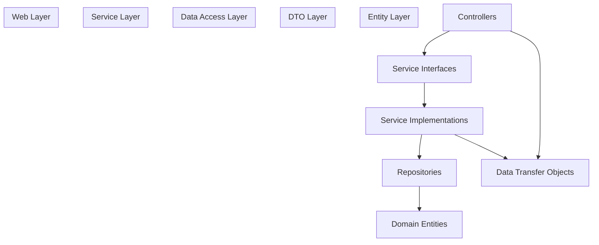
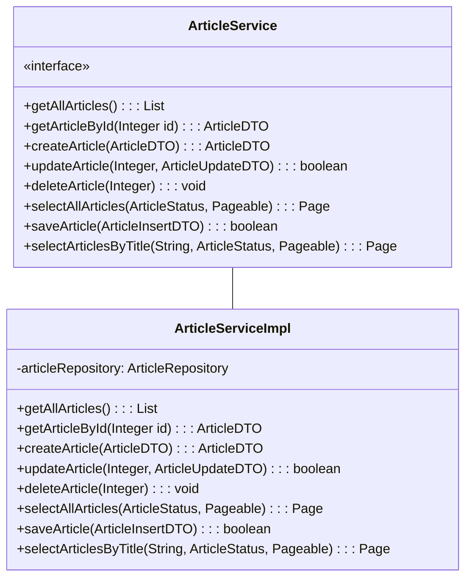
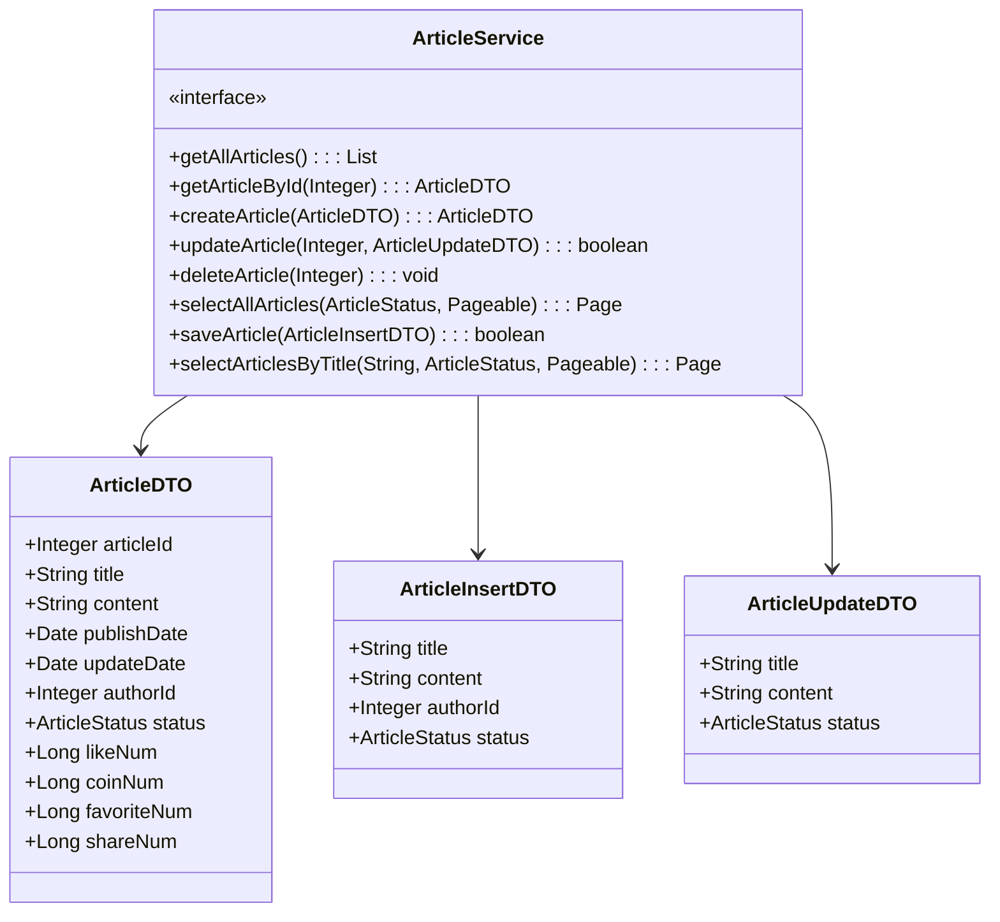
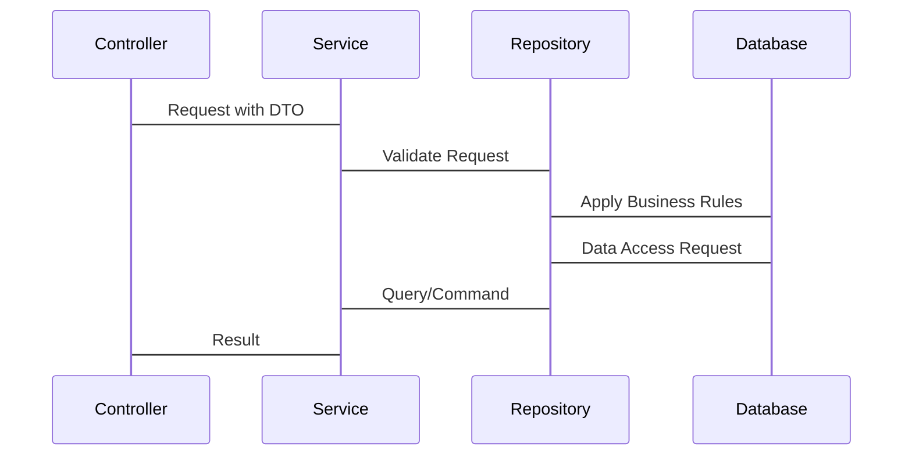
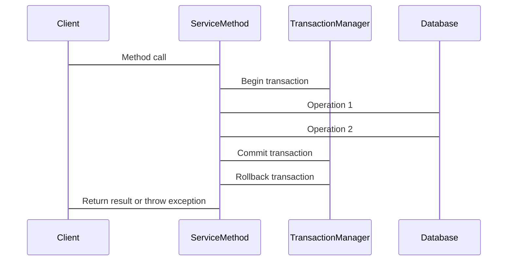
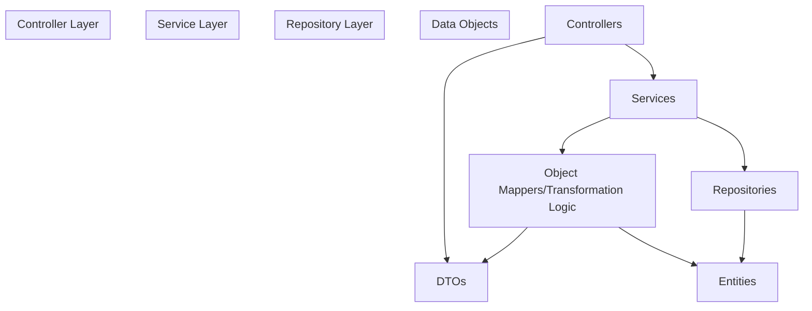
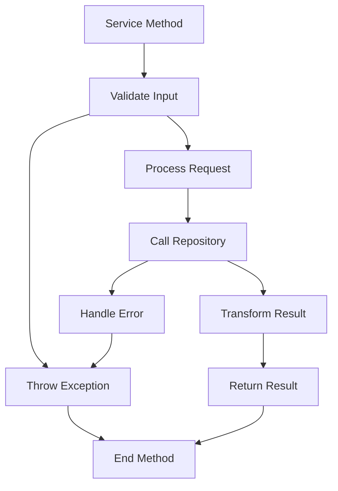

# Service Layer

> **Relevant source files**
> * [SEUNewsWebsite/src/main/java/com/royzhang/seunewswebsite/service/ArticleService.java](https://github.com/zsqgleRoy/SEUNews/blob/9be5e28c/SEUNewsWebsite/src/main/java/com/royzhang/seunewswebsite/service/ArticleService.java)

## Purpose and Scope

The Service Layer in the SEUNews system represents the middle tier in the backend architecture, implementing the core business logic of the application. This layer encapsulates all domain-specific operations and rules, serving as an intermediary between the Controller Layer ([Controllers](/zsqgleRoy/SEUNews/4.1-controllers)) and the Repository Layer. It handles all application logic independently of the presentation layer, ensuring a proper separation of concerns.

This document focuses specifically on the structure, responsibilities, and implementation of service components in the SEUNews application, examining how they translate business requirements into executable operations while maintaining system integrity.

## Service Layer Architecture

The Service Layer in SEUNews follows the standard Spring Boot service architecture, organizing business logic into cohesive functional units. Services are implemented as Spring components, often following an interface-based design pattern to promote loose coupling and facilitate testing.

### Position in Overall Architecture

The Service Layer occupies a central position in the application's architecture:

Sources: [SEUNewsWebsite/src/main/java/com/royzhang/seunewswebsite/service/ArticleService.java L1-L75](https://github.com/zsqgleRoy/SEUNews/blob/9be5e28c/SEUNewsWebsite/src/main/java/com/royzhang/seunewswebsite/service/ArticleService.java#L1-L75)

### Service Design Pattern

Services in SEUNews follow an interface-implementation pattern:

Sources: [SEUNewsWebsite/src/main/java/com/royzhang/seunewswebsite/service/ArticleService.java L16-L75](https://github.com/zsqgleRoy/SEUNews/blob/9be5e28c/SEUNewsWebsite/src/main/java/com/royzhang/seunewswebsite/service/ArticleService.java#L16-L75)

## Core Service Interfaces

The SEUNews system contains several service interfaces that define the business operations available for different domain areas. These interfaces establish contracts that service implementations must fulfill.

### Primary Service Interfaces

Based on the system architecture, the SEUNews application appears to have the following key service interfaces:

| Service Interface | Primary Responsibility |
| --- | --- |
| ArticleService | Managing article content and metadata |
| UserService | User account management |
| ArticleLikeService | Handling article like functionality |
| ArticleFavoriteService | Managing article favorites |
| ArticleCoinService | Handling coin contributions for articles |
| CommentService | Managing article comments |
| CategoryService | Handling article categories |
| TagService | Managing article tags |

Sources: [SEUNewsWebsite/src/main/java/com/royzhang/seunewswebsite/service/ArticleService.java L16-L75](https://github.com/zsqgleRoy/SEUNews/blob/9be5e28c/SEUNewsWebsite/src/main/java/com/royzhang/seunewswebsite/service/ArticleService.java#L16-L75)

### ArticleService Example

The `ArticleService` interface demonstrates a typical service contract in the system:

Sources: [SEUNewsWebsite/src/main/java/com/royzhang/seunewswebsite/service/ArticleService.java L16-L75](https://github.com/zsqgleRoy/SEUNews/blob/9be5e28c/SEUNewsWebsite/src/main/java/com/royzhang/seunewswebsite/service/ArticleService.java#L16-L75)

## Business Logic Implementation

The Service Layer is responsible for implementing all business rules and requirements. Service implementations contain the actual business logic that processes data, enforces rules, and orchestrates operations.

### Service Implementation Pattern

Service implementations in the SEUNews system typically:

1. Receive DTOs from controllers
2. Transform DTOs to entities when needed
3. Apply business logic and validations
4. Use repositories to perform CRUD operations
5. Transform entities back to DTOs for return to controllers

Sources: [SEUNewsWebsite/src/main/java/com/royzhang/seunewswebsite/service/ArticleService.java L16-L75](https://github.com/zsqgleRoy/SEUNews/blob/9be5e28c/SEUNewsWebsite/src/main/java/com/royzhang/seunewswebsite/service/ArticleService.java#L16-L75)

### Key Operations in ArticleService

The ArticleService interface defines several critical operations:

1. **Content Management**:

* Creating articles (`createArticle`, `saveArticle`)
* Retrieving articles (`getArticleById`, `getAllArticles`)
* Updating articles (`updateArticle`)
* Deleting articles (`deleteArticle`)
2. **Content Discovery**:

* Filtering by status (`selectAllArticles`)
* Searching by title (`selectArticlesByTitle`)
3. **Pagination Support**:

* Methods accepting `Pageable` parameter for pagination

Sources: [SEUNewsWebsite/src/main/java/com/royzhang/seunewswebsite/service/ArticleService.java L16-L75](https://github.com/zsqgleRoy/SEUNews/blob/9be5e28c/SEUNewsWebsite/src/main/java/com/royzhang/seunewswebsite/service/ArticleService.java#L16-L75)

## Transaction Management

Service methods in the SEUNews system are typically annotated with `@Transactional` to ensure database operations maintain ACID properties:

Transaction management ensures that related operations either all succeed or all fail, maintaining data integrity.

Sources: [SEUNewsWebsite/src/main/java/com/royzhang/seunewswebsite/service/ArticleService.java L16-L75](https://github.com/zsqgleRoy/SEUNews/blob/9be5e28c/SEUNewsWebsite/src/main/java/com/royzhang/seunewswebsite/service/ArticleService.java#L16-L75)

## DTO Transformation

A key responsibility of the Service Layer is transforming between DTOs (Data Transfer Objects) and domain entities:

The SEUNews service layer uses several specialized DTOs for different operations:

* **ArticleDTO**: General-purpose DTO for article data
* **ArticleInsertDTO**: Specialized for article creation operations
* **ArticleUpdateDTO**: Specialized for article update operations
* **ArticleFrontDTO**: Specialized for frontend presentation

This specialized approach allows the service to tailor data structures for specific use cases.

Sources: [SEUNewsWebsite/src/main/java/com/royzhang/seunewswebsite/service/ArticleService.java L3-L7](https://github.com/zsqgleRoy/SEUNews/blob/9be5e28c/SEUNewsWebsite/src/main/java/com/royzhang/seunewswebsite/service/ArticleService.java#L3-L7)

## Error Handling and Validation

The Service Layer is responsible for validating input data and handling errors appropriately:

Services may:

1. Validate inputs before processing
2. Handle repository exceptions and translate them to appropriate service exceptions
3. Enforce business rules and constraints
4. Provide meaningful error messages for clients

Sources: [SEUNewsWebsite/src/main/java/com/royzhang/seunewswebsite/service/ArticleService.java L16-L75](https://github.com/zsqgleRoy/SEUNews/blob/9be5e28c/SEUNewsWebsite/src/main/java/com/royzhang/seunewswebsite/service/ArticleService.java#L16-L75)

## Summary

The Service Layer in the SEUNews system serves as the central component for business logic implementation. It provides a clear separation between presentation logic (controllers) and data access logic (repositories), using DTO objects for data exchange. The layer is designed around well-defined interfaces like `ArticleService` that establish clear contracts for business operations.

Through transaction management, validation, and error handling, the Service Layer ensures that business operations are executed correctly and consistently, maintaining the integrity of the application data and business rules.