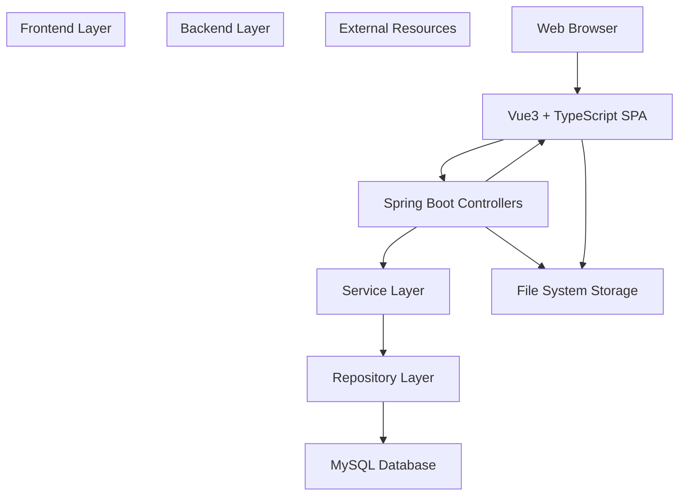
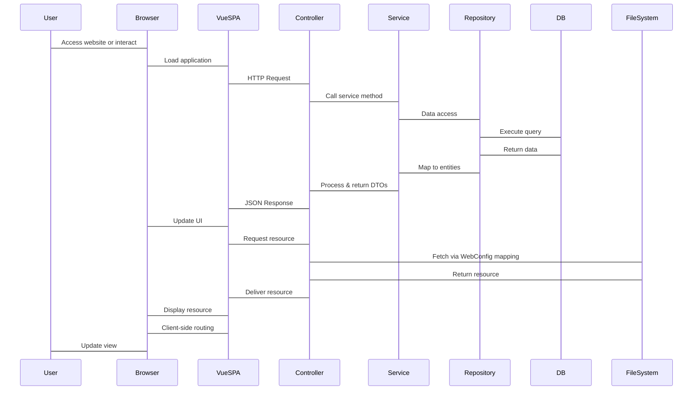
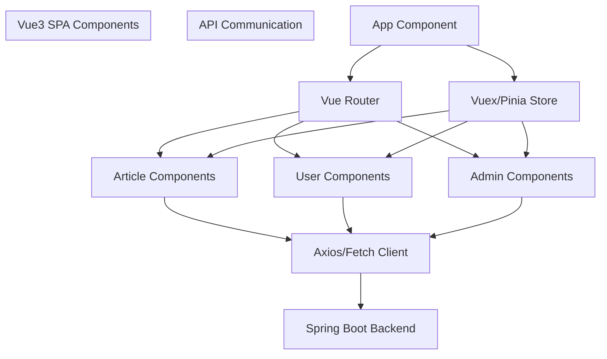
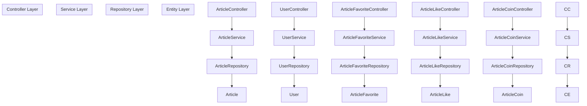
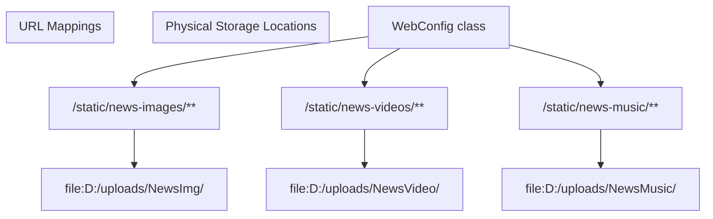
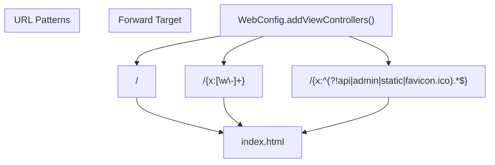
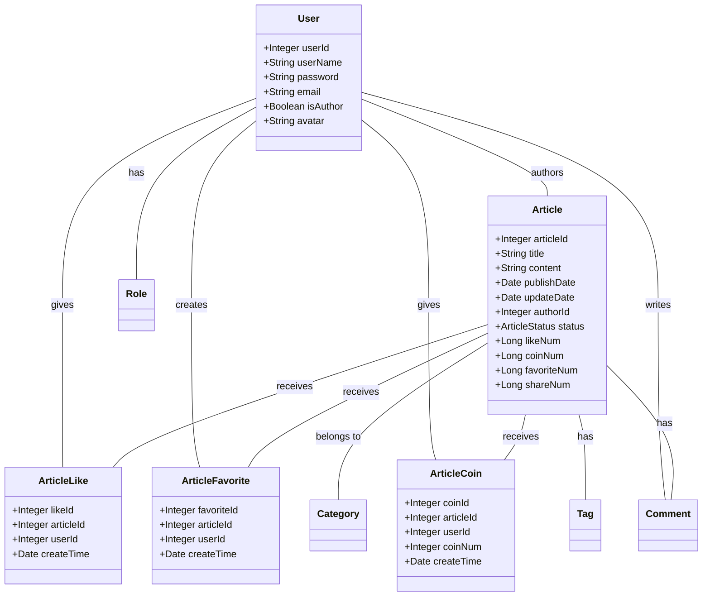
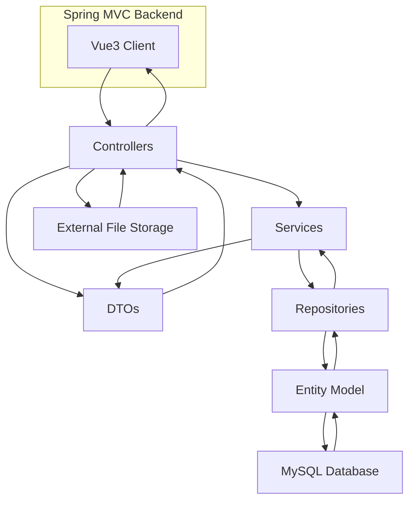
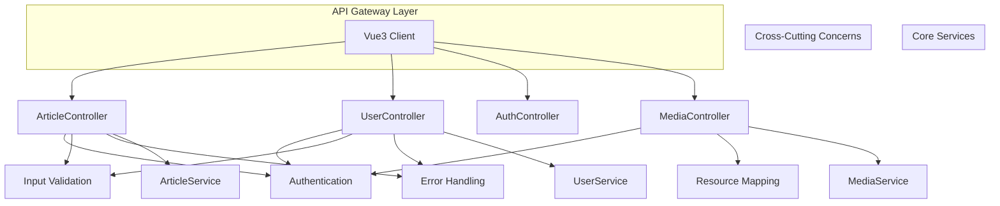

# System Architecture

> **Relevant source files**
> * [README.md](https://github.com/zsqgleRoy/SEUNews/blob/9be5e28c/README.md)
> * [SEUNewsWebsite/src/main/java/com/royzhang/seunewswebsite/WebConfig.java](https://github.com/zsqgleRoy/SEUNews/blob/9be5e28c/SEUNewsWebsite/src/main/java/com/royzhang/seunewswebsite/WebConfig.java)

## Purpose and Scope

This document describes the high-level architecture of the SEUNews system, illustrating the relationships between the frontend (Vue3/TypeScript), backend (Spring Boot), and database (MySQL) components. It provides a comprehensive overview of how these systems interact to deliver a cohesive news platform.

For details about how static resources (images, videos, and music) are specifically configured and managed, see [Static Resource Management](/zsqgleRoy/SEUNews/2.1-static-resource-management).

## High-Level Architecture Overview

The SEUNews system implements a modern web application architecture with clear separation of concerns between client and server components.

### System Layers Diagram

Sources: [SEUNewsWebsite/src/main/java/com/royzhang/seunewswebsite/WebConfig.java](https://github.com/zsqgleRoy/SEUNews/blob/9be5e28c/SEUNewsWebsite/src/main/java/com/royzhang/seunewswebsite/WebConfig.java)

## Component Interaction Flow

The following diagram illustrates how user requests flow through the system:

Sources: [SEUNewsWebsite/src/main/java/com/royzhang/seunewswebsite/WebConfig.java L11-L15](https://github.com/zsqgleRoy/SEUNews/blob/9be5e28c/SEUNewsWebsite/src/main/java/com/royzhang/seunewswebsite/WebConfig.java#L11-L15)

## Frontend Architecture

The frontend is built as a Single Page Application (SPA) using Vue3 and TypeScript, providing a responsive and interactive user interface.

### Key Frontend Components

## Backend Architecture

The backend follows the Spring MVC architecture with a layered design for separation of concerns.

### Spring MVC Implementation

### Request Processing Pipeline

The Spring Boot backend processes requests through a well-defined pipeline:

1. **Request Handling**: Controllers receive HTTP requests and validate inputs
2. **Authentication & Authorization**: Security checks are performed
3. **Business Logic**: Services implement the business logic
4. **Data Access**: Repositories interact with the database
5. **Response Formation**: Controllers transform data into appropriate DTOs and return JSON responses

## Static Resource Configuration

SEUNews implements a custom approach to static resource management through Spring's `WebMvcConfigurer` interface.

Sources: [SEUNewsWebsite/src/main/java/com/royzhang/seunewswebsite/WebConfig.java L11-L15](https://github.com/zsqgleRoy/SEUNews/blob/9be5e28c/SEUNewsWebsite/src/main/java/com/royzhang/seunewswebsite/WebConfig.java#L11-L15)

## Client-Side Routing Support

The system supports client-side routing for the SPA by configuring specific view controllers to forward requests to the frontend application:

Sources: [SEUNewsWebsite/src/main/java/com/royzhang/seunewswebsite/WebConfig.java L16-L21](https://github.com/zsqgleRoy/SEUNews/blob/9be5e28c/SEUNewsWebsite/src/main/java/com/royzhang/seunewswebsite/WebConfig.java#L16-L21)

## Domain Model Architecture

The system's core domain model is centered around Articles, with various related entities to support user interactions and content management:

## Data Flow Architecture

The following diagram illustrates the data flow through the system components:

## API Gateway Pattern

The controller layer acts as an API Gateway, providing a unified entry point for frontend requests and handling cross-cutting concerns:

## Summary

The SEUNews application implements a modern, layered architecture with clear separation of concerns. The system follows a client-server model with:

1. **Frontend Layer**: A Vue3/TypeScript Single Page Application
2. **Backend Layer**: Spring Boot implementing MVC pattern with controllers, services, and repositories
3. **Database Layer**: MySQL database for persistent storage
4. **External Storage**: File system storage for media content

Key architectural patterns used include:

* MVC (Model-View-Controller)
* Repository pattern for data access
* DTO pattern for API communication
* Layered architecture for separation of concerns
* Single Page Application for frontend
* REST API for communication between frontend and backend

The system's architecture provides a solid foundation for a scalable, maintainable news website with rich features for content management and user interaction.

Sources: [SEUNewsWebsite/src/main/java/com/royzhang/seunewswebsite/WebConfig.java](https://github.com/zsqgleRoy/SEUNews/blob/9be5e28c/SEUNewsWebsite/src/main/java/com/royzhang/seunewswebsite/WebConfig.java)

 [README.md](https://github.com/zsqgleRoy/SEUNews/blob/9be5e28c/README.md)