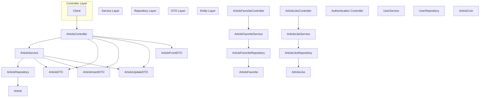
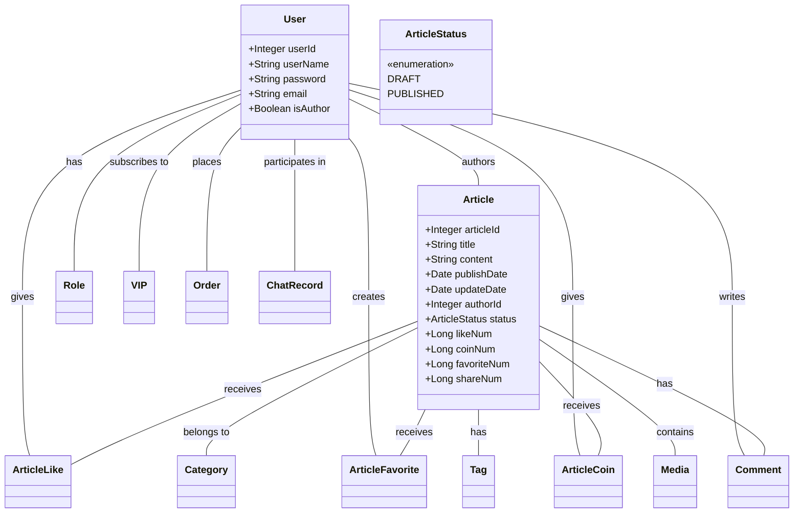
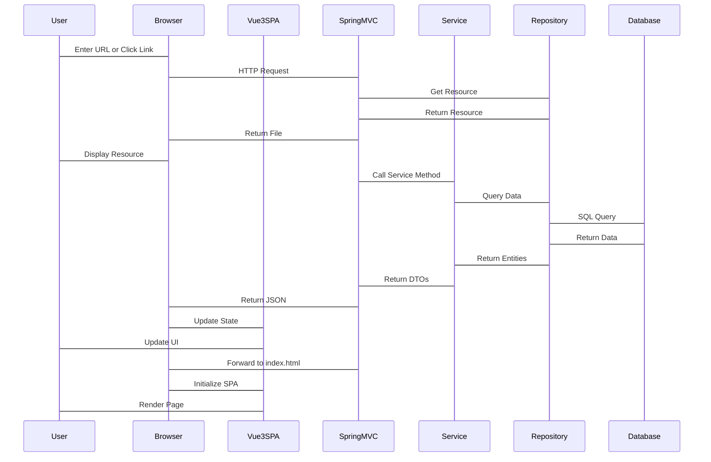
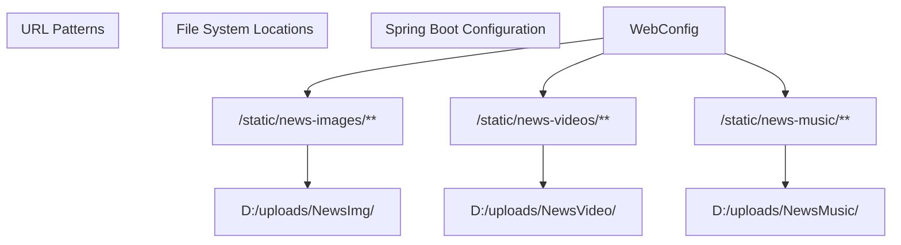
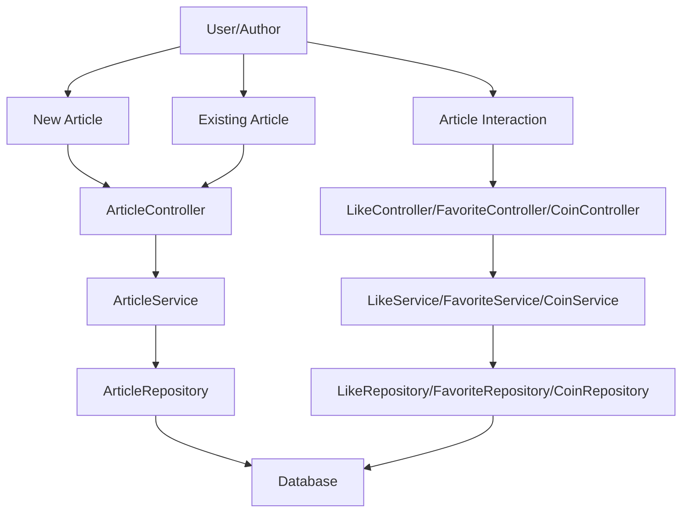
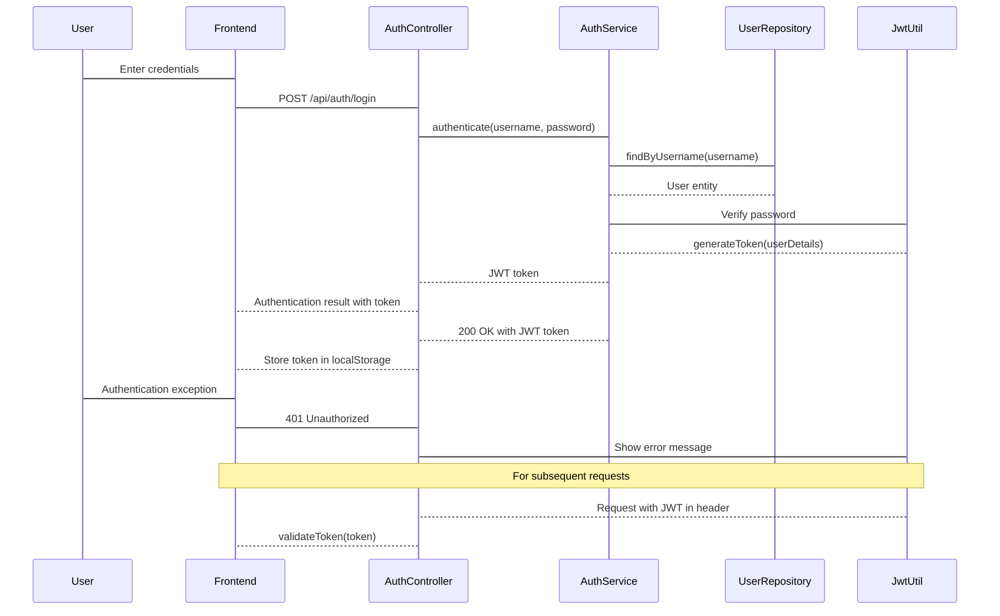
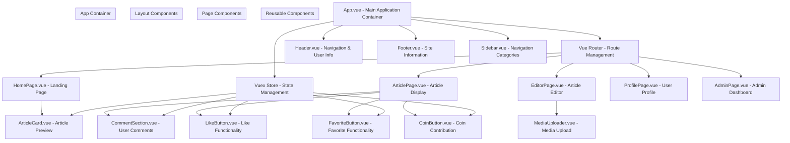
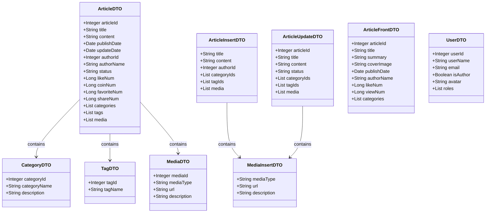
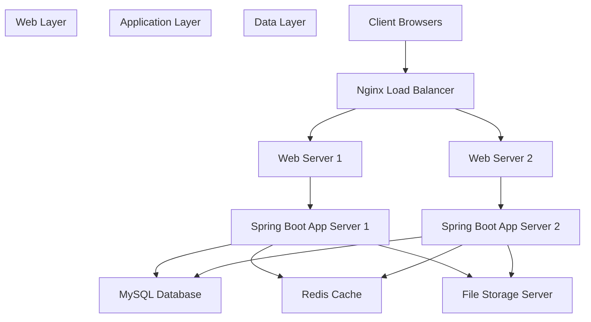

# System Diagrams and Visual Documentation

> **Relevant source files**
> * [images/2025-05-03-09-05-23-image.png](https://github.com/zsqgleRoy/SEUNews/blob/9be5e28c/images/2025-05-03-09-05-23-image.png)
> * [images/2025-05-03-09-20-50-image.png](https://github.com/zsqgleRoy/SEUNews/blob/9be5e28c/images/2025-05-03-09-20-50-image.png)
> * [images/2025-05-03-09-21-19-image.png](https://github.com/zsqgleRoy/SEUNews/blob/9be5e28c/images/2025-05-03-09-21-19-image.png)
> * [images/2025-05-03-09-27-24-image.png](https://github.com/zsqgleRoy/SEUNews/blob/9be5e28c/images/2025-05-03-09-27-24-image.png)
> * [images/2025-05-03-09-51-12-image.png](https://github.com/zsqgleRoy/SEUNews/blob/9be5e28c/images/2025-05-03-09-51-12-image.png)
> * [images/2025-05-03-10-00-35-image.png](https://github.com/zsqgleRoy/SEUNews/blob/9be5e28c/images/2025-05-03-10-00-35-image.png)
> * [images/2025-05-03-10-02-45-image.png](https://github.com/zsqgleRoy/SEUNews/blob/9be5e28c/images/2025-05-03-10-02-45-image.png)
> * [images/2025-05-03-10-04-57-image.png](https://github.com/zsqgleRoy/SEUNews/blob/9be5e28c/images/2025-05-03-10-04-57-image.png)
> * [images/2025-05-03-10-05-07-image.png](https://github.com/zsqgleRoy/SEUNews/blob/9be5e28c/images/2025-05-03-10-05-07-image.png)

## Purpose and Scope

This document provides comprehensive visual representations of the SEU News system architecture, component interactions, data flows, and key system processes. These diagrams serve as technical reference material for developers working on the codebase, offering insights into system organization, architecture decisions, and component relationships.

For information about static resource handling specifically, see [Static Resource Management](/zsqgleRoy/SEUNews/2.1-static-resource-management).

## System Architecture Overview

The SEU News system follows a modern web application architecture with clear separation between frontend, backend, and database components. The architecture is designed to support a full-featured news website with user management, article management, and monetization features.

### High-Level System Architecture

```

```

Sources: images/2025-05-03-09-05-23-image.png

### Backend Architecture

The backend follows the Spring MVC architecture pattern with clear separation of concerns between controllers, services, and repositories.



Sources: images/2025-05-03-09-05-23-image.png

## Domain Model Representation

The system is built around several key domain entities, with Articles being the central concept.

### Core Domain Models



Sources: images/2025-05-03-09-05-23-image.png

## Database Schema

The database schema supports all aspects of the news website including articles, users, interactions, and monetization.

```
#mermaid-l6mzl49rq1s{font-family:ui-sans-serif,-apple-system,system-ui,Segoe UI,Helvetica;font-size:16px;fill:#333;}@keyframes edge-animation-frame{from{stroke-dashoffset:0;}}@keyframes dash{to{stroke-dashoffset:0;}}#mermaid-l6mzl49rq1s .edge-animation-slow{stroke-dasharray:9,5!important;stroke-dashoffset:900;animation:dash 50s linear infinite;stroke-linecap:round;}#mermaid-l6mzl49rq1s .edge-animation-fast{stroke-dasharray:9,5!important;stroke-dashoffset:900;animation:dash 20s linear infinite;stroke-linecap:round;}#mermaid-l6mzl49rq1s .error-icon{fill:#dddddd;}#mermaid-l6mzl49rq1s .error-text{fill:#222222;stroke:#222222;}#mermaid-l6mzl49rq1s .edge-thickness-normal{stroke-width:1px;}#mermaid-l6mzl49rq1s .edge-thickness-thick{stroke-width:3.5px;}#mermaid-l6mzl49rq1s .edge-pattern-solid{stroke-dasharray:0;}#mermaid-l6mzl49rq1s .edge-thickness-invisible{stroke-width:0;fill:none;}#mermaid-l6mzl49rq1s .edge-pattern-dashed{stroke-dasharray:3;}#mermaid-l6mzl49rq1s .edge-pattern-dotted{stroke-dasharray:2;}#mermaid-l6mzl49rq1s .marker{fill:#999;stroke:#999;}#mermaid-l6mzl49rq1s .marker.cross{stroke:#999;}#mermaid-l6mzl49rq1s svg{font-family:ui-sans-serif,-apple-system,system-ui,Segoe UI,Helvetica;font-size:16px;}#mermaid-l6mzl49rq1s p{margin:0;}#mermaid-l6mzl49rq1s .entityBox{fill:#ffffff;stroke:#dddddd;}#mermaid-l6mzl49rq1s .relationshipLabelBox{fill:#dddddd;opacity:0.7;background-color:#dddddd;}#mermaid-l6mzl49rq1s .relationshipLabelBox rect{opacity:0.5;}#mermaid-l6mzl49rq1s .labelBkg{background-color:rgba(221, 221, 221, 0.5);}#mermaid-l6mzl49rq1s .edgeLabel .label{fill:#dddddd;font-size:14px;}#mermaid-l6mzl49rq1s .label{font-family:ui-sans-serif,-apple-system,system-ui,Segoe UI,Helvetica;color:#333;}#mermaid-l6mzl49rq1s .edge-pattern-dashed{stroke-dasharray:8,8;}#mermaid-l6mzl49rq1s .node rect,#mermaid-l6mzl49rq1s .node circle,#mermaid-l6mzl49rq1s .node ellipse,#mermaid-l6mzl49rq1s .node polygon{fill:#ffffff;stroke:#dddddd;stroke-width:1px;}#mermaid-l6mzl49rq1s .relationshipLine{stroke:#999;stroke-width:1;fill:none;}#mermaid-l6mzl49rq1s .marker{fill:none!important;stroke:#999!important;stroke-width:1;}#mermaid-l6mzl49rq1s :root{--mermaid-font-family:"trebuchet ms",verdana,arial,sans-serif;}tracks_changesbelongs_tohascontainsreceivesreceivesreceiveshasauthorsgivescreatesgiveswriteshassubscribes_toplacesparticipates_incategorizestagsassigned_topurchased_byARTICLESintarticle_idPKvarchartitletextcontentdatetimepublish_datedatetimeupdate_dateintauthor_idFKenumstatusintis_deletedintlast_operator_idbigintlike_numbigintcoin_numbigintfavorit_numbigintshare_numARTICLE_VERSIONSARTICLE_CATEGORIESARTICLE_TAGSMEDIAARTICLE_LIKESARTICLE_FAVORITESARTICLE_COINSCOMMENTSUSERSintuser_idPKvarcharuser_namevarcharpasswordvarcharemailenumis_authorvarcharavatarUSER_ROLE_RELATIONSUSER_VIP_RELATIONSORDERSCHAT_RECORDSCATEGORIESTAGSUSER_ROLESVIP
```

Sources: images/2025-05-03-09-05-23-image.png

## Request Processing Flow

The system processes requests using a standard flow pattern with support for Single Page Application (SPA) routing.



Sources: images/2025-05-03-09-05-23-image.png

## Static Resource Management

The system uses custom configuration to map static resources to specific directories. This ensures proper organization and access to media files like images, videos, and music used in news articles.



Sources: images/2025-05-03-09-05-23-image.png

The configuration for static resources is managed in the WebConfig class, which extends `WebMvcConfigurer` to override resource handling methods.

## Article Management Flow

The flow of article creation, editing, and publishing is central to the SEU News system. This diagram maps the process to specific code entities.



Sources: images/2025-05-03-09-05-23-image.png, images/2025-05-03-09-20-50-image.png

## User Authentication and Authorization

The authentication and authorization flow illustrates how users are authenticated and how permissions are managed.



Sources: images/2025-05-03-09-20-50-image.png, images/2025-05-03-09-21-19-image.png

## Frontend Component Structure

This diagram maps the Vue3 frontend components to their responsibilities in the SEU News application, showing the hierarchy and relationships between components.



Sources: images/2025-05-03-09-21-19-image.png, images/2025-05-03-09-27-24-image.png

## API Endpoints

The following table documents the main API endpoints in the SEU News system:

| Endpoint | Method | Description | Controller | Service Method |
| --- | --- | --- | --- | --- |
| `/api/article` | GET | Get all articles | ArticleController | findAll() |
| `/api/article/{id}` | GET | Get article by ID | ArticleController | findById() |
| `/api/article` | POST | Create a new article | ArticleController | insert() |
| `/api/article/{id}` | PUT | Update an existing article | ArticleController | update() |
| `/api/article/{id}` | DELETE | Delete an article | ArticleController | delete() |
| `/api/article/like/{id}` | POST | Like an article | ArticleLikeController | like() |
| `/api/article/favorite/{id}` | POST | Favorite an article | ArticleFavoriteController | favorite() |
| `/api/article/coin/{id}` | POST | Give coins to an article | ArticleCoinController | giveCoin() |
| `/api/user/register` | POST | Register a new user | UserController | register() |
| `/api/user/login` | POST | User login | UserController | login() |
| `/api/user/{id}` | GET | Get user information | UserController | findById() |
| `/api/category` | GET | Get all categories | CategoryController | findAll() |
| `/api/comment/{articleId}` | GET | Get comments for an article | CommentController | getByArticleId() |
| `/api/comment` | POST | Add a comment | CommentController | insert() |

Sources: images/2025-05-03-09-27-24-image.png, images/2025-05-03-10-00-35-image.png

## Data Transfer Objects (DTOs)

DTOs are used to transfer data between layers of the application. The following class diagram shows the key DTOs used in the article management system:



Sources: images/2025-05-03-09-27-24-image.png, images/2025-05-03-10-00-35-image.png

## Deployment Architecture

This diagram illustrates how the SEU News system is deployed in a production environment.



Sources: images/2025-05-03-10-00-35-image.png, images/2025-05-03-10-02-45-image.png

## System Component Responsibilities

The following table summarizes the responsibilities of the major components in the SEU News system:

| Component | Description | Responsibilities |
| --- | --- | --- |
| Vue3 Frontend | Single-page application | - User interface rendering- Client-side state management- Form validation- User interaction handling |
| ArticleController | REST API controller | - Handle article-related HTTP requests- Validate input data- Transform between DTOs and service layer |
| ArticleService | Business logic service | - Apply business rules- Coordinate operations- Transform between DTOs and entities |
| ArticleRepository | Data access layer | - Perform CRUD operations on article entities- Execute database queries |
| UserController/Service | User management | - Handle authentication/authorization- User registration- Profile management |
| StaticResourceController | Media handling | - Handle uploads/downloads of images, videos, and music- Validate media files |
| WebConfig | Configuration | - Configure resource handling- Set up security- Define cors policy |

Sources: images/2025-05-03-09-05-23-image.png, images/2025-05-03-09-20-50-image.png, images/2025-05-03-09-21-19-image.png