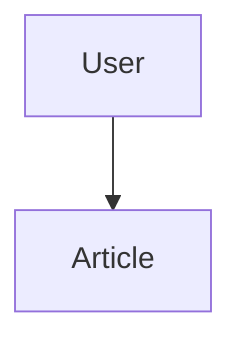
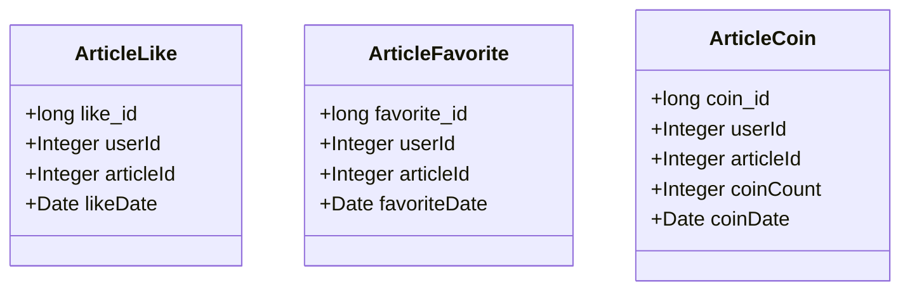
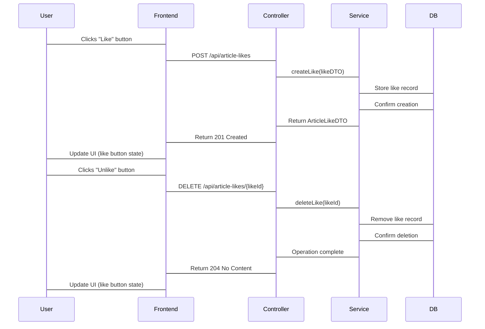
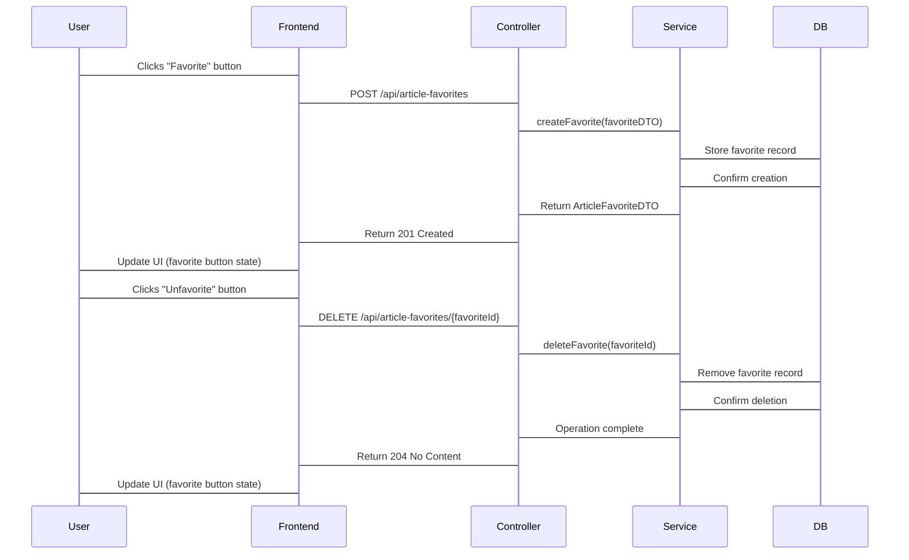
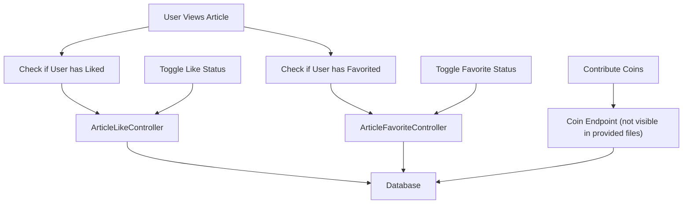

# User Interactions with Articles

> **Relevant source files**
> * [SEUNewsWebsite/src/main/java/com/royzhang/seunewswebsite/controller/ArticleFavoriteController.java](https://github.com/zsqgleRoy/SEUNews/blob/9be5e28c/SEUNewsWebsite/src/main/java/com/royzhang/seunewswebsite/controller/ArticleFavoriteController.java)
> * [SEUNewsWebsite/src/main/java/com/royzhang/seunewswebsite/controller/ArticleLikeController.java](https://github.com/zsqgleRoy/SEUNews/blob/9be5e28c/SEUNewsWebsite/src/main/java/com/royzhang/seunewswebsite/controller/ArticleLikeController.java)
> * [SEUNewsWebsite/src/main/java/com/royzhang/seunewswebsite/entity/ArticleCoin.java](https://github.com/zsqgleRoy/SEUNews/blob/9be5e28c/SEUNewsWebsite/src/main/java/com/royzhang/seunewswebsite/entity/ArticleCoin.java)
> * [SEUNewsWebsite/src/main/java/com/royzhang/seunewswebsite/entity/ArticleFavorite.java](https://github.com/zsqgleRoy/SEUNews/blob/9be5e28c/SEUNewsWebsite/src/main/java/com/royzhang/seunewswebsite/entity/ArticleFavorite.java)
> * [SEUNewsWebsite/src/main/java/com/royzhang/seunewswebsite/entity/ArticleLike.java](https://github.com/zsqgleRoy/SEUNews/blob/9be5e28c/SEUNewsWebsite/src/main/java/com/royzhang/seunewswebsite/entity/ArticleLike.java)

## Purpose and Scope

This document details the mechanisms that allow users to interact with articles in the SEU News system. The system supports three primary types of user interactions: liking articles, adding articles to favorites, and contributing coins to articles. This page focuses on the technical implementation of these features, including the relevant entities, controllers, and API endpoints.

For information about article content management, see [Article Management System](/zsqgleRoy/SEUNews/5-article-management-system).

## User Interaction Types Overview

The SEU News system provides three distinct ways for users to engage with articles:

1. **Likes**: Users can like articles to show appreciation
2. **Favorites**: Users can add articles to their favorites for later access
3. **Coins**: Users can contribute virtual coins to articles as a form of premium appreciation

Each interaction type is tracked in the database and affects the article's popularity metrics.



Sources: [SEUNewsWebsite/src/main/java/com/royzhang/seunewswebsite/entity/ArticleLike.java](https://github.com/zsqgleRoy/SEUNews/blob/9be5e28c/SEUNewsWebsite/src/main/java/com/royzhang/seunewswebsite/entity/ArticleLike.java)

 [SEUNewsWebsite/src/main/java/com/royzhang/seunewswebsite/entity/ArticleFavorite.java](https://github.com/zsqgleRoy/SEUNews/blob/9be5e28c/SEUNewsWebsite/src/main/java/com/royzhang/seunewswebsite/entity/ArticleFavorite.java)

 [SEUNewsWebsite/src/main/java/com/royzhang/seunewswebsite/entity/ArticleCoin.java](https://github.com/zsqgleRoy/SEUNews/blob/9be5e28c/SEUNewsWebsite/src/main/java/com/royzhang/seunewswebsite/entity/ArticleCoin.java)

## Entity Models for User Interactions

### Core Entities

Each interaction type has a corresponding entity in the system:



These entities store the relationship between users and articles for each interaction type. Key attributes include:

| Entity | Primary Key | User Reference | Article Reference | Additional Data |
| --- | --- | --- | --- | --- |
| ArticleLike | like_id | userId | articleId | likeDate |
| ArticleFavorite | favorite_id | userId | articleId | favoriteDate |
| ArticleCoin | coin_id | userId | articleId | coinCount, coinDate |

Sources: [SEUNewsWebsite/src/main/java/com/royzhang/seunewswebsite/entity/ArticleLike.java L13-L16](https://github.com/zsqgleRoy/SEUNews/blob/9be5e28c/SEUNewsWebsite/src/main/java/com/royzhang/seunewswebsite/entity/ArticleLike.java#L13-L16)

 [SEUNewsWebsite/src/main/java/com/royzhang/seunewswebsite/entity/ArticleFavorite.java L13-L16](https://github.com/zsqgleRoy/SEUNews/blob/9be5e28c/SEUNewsWebsite/src/main/java/com/royzhang/seunewswebsite/entity/ArticleFavorite.java#L13-L16)

 [SEUNewsWebsite/src/main/java/com/royzhang/seunewswebsite/entity/ArticleCoin.java L13-L16](https://github.com/zsqgleRoy/SEUNews/blob/9be5e28c/SEUNewsWebsite/src/main/java/com/royzhang/seunewswebsite/entity/ArticleCoin.java#L13-L16)

## Article Likes System

The article likes system allows users to express appreciation for articles through a simple "like" action.

### Like API Endpoints

The `ArticleLikeController` provides the following endpoints:

| HTTP Method | Endpoint | Description |
| --- | --- | --- |
| GET | `/api/article-likes/article/{articleId}` | Get all likes for an article |
| GET | `/api/article-likes/{likeId}` | Get specific like by ID |
| POST | `/api/article-likes` | Create a new like |
| DELETE | `/api/article-likes/{likeId}` | Delete an existing like |
| GET | `/api/article-likes/user/{userId}/article/{articleId}` | Check if user has liked an article |

### Like Interaction Flow



Sources: [SEUNewsWebsite/src/main/java/com/royzhang/seunewswebsite/controller/ArticleLikeController.java L19-L50](https://github.com/zsqgleRoy/SEUNews/blob/9be5e28c/SEUNewsWebsite/src/main/java/com/royzhang/seunewswebsite/controller/ArticleLikeController.java#L19-L50)

## Article Favorites System

The article favorites system allows users to bookmark articles for later reference.

### Favorites API Endpoints

The `ArticleFavoriteController` provides the following endpoints:

| HTTP Method | Endpoint | Description |
| --- | --- | --- |
| GET | `/api/article-favorites/user/{userId}` | Get all favorites for a user |
| GET | `/api/article-favorites/{favoriteId}` | Get specific favorite by ID |
| POST | `/api/article-favorites` | Create a new favorite |
| DELETE | `/api/article-favorites/{favoriteId}` | Delete an existing favorite |
| GET | `/api/article-favorites/user/{userId}/article/{articleId}` | Check if user has favorited an article |

### Favorite Interaction Flow



Sources: [SEUNewsWebsite/src/main/java/com/royzhang/seunewswebsite/controller/ArticleFavoriteController.java L19-L50](https://github.com/zsqgleRoy/SEUNews/blob/9be5e28c/SEUNewsWebsite/src/main/java/com/royzhang/seunewswebsite/controller/ArticleFavoriteController.java#L19-L50)

## Article Coins System

The article coins system allows users to contribute virtual coins to articles as a form of premium appreciation. Unlike likes and favorites, coins have a quantity associated with each contribution.

### Coins Entity Structure

The `ArticleCoin` entity includes:

* `coin_id`: Unique identifier for the coin contribution
* `userId`: The user who contributed coins
* `articleId`: The article receiving the coins
* `coinCount`: Number of coins contributed
* `coinDate`: When the contribution occurred

Based on the provided files, there doesn't appear to be a dedicated controller for coin operations in the samples provided. The functionality is likely implemented elsewhere in the codebase.

Sources: [SEUNewsWebsite/src/main/java/com/royzhang/seunewswebsite/entity/ArticleCoin.java L13-L28](https://github.com/zsqgleRoy/SEUNews/blob/9be5e28c/SEUNewsWebsite/src/main/java/com/royzhang/seunewswebsite/entity/ArticleCoin.java#L13-L28)

## User Interaction Data Model

The following diagram illustrates how user interactions relate to articles and users in the database schema:

```
#mermaid-jvh09bd2bh{font-family:ui-sans-serif,-apple-system,system-ui,Segoe UI,Helvetica;font-size:16px;fill:#333;}@keyframes edge-animation-frame{from{stroke-dashoffset:0;}}@keyframes dash{to{stroke-dashoffset:0;}}#mermaid-jvh09bd2bh .edge-animation-slow{stroke-dasharray:9,5!important;stroke-dashoffset:900;animation:dash 50s linear infinite;stroke-linecap:round;}#mermaid-jvh09bd2bh .edge-animation-fast{stroke-dasharray:9,5!important;stroke-dashoffset:900;animation:dash 20s linear infinite;stroke-linecap:round;}#mermaid-jvh09bd2bh .error-icon{fill:#dddddd;}#mermaid-jvh09bd2bh .error-text{fill:#222222;stroke:#222222;}#mermaid-jvh09bd2bh .edge-thickness-normal{stroke-width:1px;}#mermaid-jvh09bd2bh .edge-thickness-thick{stroke-width:3.5px;}#mermaid-jvh09bd2bh .edge-pattern-solid{stroke-dasharray:0;}#mermaid-jvh09bd2bh .edge-thickness-invisible{stroke-width:0;fill:none;}#mermaid-jvh09bd2bh .edge-pattern-dashed{stroke-dasharray:3;}#mermaid-jvh09bd2bh .edge-pattern-dotted{stroke-dasharray:2;}#mermaid-jvh09bd2bh .marker{fill:#999;stroke:#999;}#mermaid-jvh09bd2bh .marker.cross{stroke:#999;}#mermaid-jvh09bd2bh svg{font-family:ui-sans-serif,-apple-system,system-ui,Segoe UI,Helvetica;font-size:16px;}#mermaid-jvh09bd2bh p{margin:0;}#mermaid-jvh09bd2bh .entityBox{fill:#ffffff;stroke:#dddddd;}#mermaid-jvh09bd2bh .relationshipLabelBox{fill:#dddddd;opacity:0.7;background-color:#dddddd;}#mermaid-jvh09bd2bh .relationshipLabelBox rect{opacity:0.5;}#mermaid-jvh09bd2bh .labelBkg{background-color:rgba(221, 221, 221, 0.5);}#mermaid-jvh09bd2bh .edgeLabel .label{fill:#dddddd;font-size:14px;}#mermaid-jvh09bd2bh .label{font-family:ui-sans-serif,-apple-system,system-ui,Segoe UI,Helvetica;color:#333;}#mermaid-jvh09bd2bh .edge-pattern-dashed{stroke-dasharray:8,8;}#mermaid-jvh09bd2bh .node rect,#mermaid-jvh09bd2bh .node circle,#mermaid-jvh09bd2bh .node ellipse,#mermaid-jvh09bd2bh .node polygon{fill:#ffffff;stroke:#dddddd;stroke-width:1px;}#mermaid-jvh09bd2bh .relationshipLine{stroke:#999;stroke-width:1;fill:none;}#mermaid-jvh09bd2bh .marker{fill:none!important;stroke:#999!important;stroke-width:1;}#mermaid-jvh09bd2bh :root{--mermaid-font-family:"trebuchet ms",verdana,arial,sans-serif;}givescreatescontributesreceivesreceivesreceivesUSERSintuser_idPKvarcharuser_namevarcharpasswordvarcharemailARTICLE_LIKESlonglike_idPKintuser_idFKintarticle_idFKdatetimelike_dateARTICLE_FAVORITESlongfavorite_idPKintuser_idFKintarticle_idFKdatetimefavorite_dateARTICLE_COINSlongcoin_idPKintuser_idFKintarticle_idFKintcoin_countdatetimecoin_dateARTICLESintarticle_idPKvarchartitletextcontentintauthor_idFKbigintlike_numbigintcoin_numbigintfavorite_num
```

Note that the `ARTICLES` table includes counters (`like_num`, `coin_num`, `favorite_num`) that track the total number of each interaction type. These counters likely provide performance benefits by avoiding the need to count interactions each time article statistics are displayed.

Sources: [SEUNewsWebsite/src/main/java/com/royzhang/seunewswebsite/entity/ArticleLike.java](https://github.com/zsqgleRoy/SEUNews/blob/9be5e28c/SEUNewsWebsite/src/main/java/com/royzhang/seunewswebsite/entity/ArticleLike.java)

 [SEUNewsWebsite/src/main/java/com/royzhang/seunewswebsite/entity/ArticleFavorite.java](https://github.com/zsqgleRoy/SEUNews/blob/9be5e28c/SEUNewsWebsite/src/main/java/com/royzhang/seunewswebsite/entity/ArticleFavorite.java)

 [SEUNewsWebsite/src/main/java/com/royzhang/seunewswebsite/entity/ArticleCoin.java](https://github.com/zsqgleRoy/SEUNews/blob/9be5e28c/SEUNewsWebsite/src/main/java/com/royzhang/seunewswebsite/entity/ArticleCoin.java)

## Complete User Interaction Flow

The following diagram illustrates the complete flow of how a user interacts with articles in the system:



Sources: [SEUNewsWebsite/src/main/java/com/royzhang/seunewswebsite/controller/ArticleLikeController.java](https://github.com/zsqgleRoy/SEUNews/blob/9be5e28c/SEUNewsWebsite/src/main/java/com/royzhang/seunewswebsite/controller/ArticleLikeController.java)

 [SEUNewsWebsite/src/main/java/com/royzhang/seunewswebsite/controller/ArticleFavoriteController.java](https://github.com/zsqgleRoy/SEUNews/blob/9be5e28c/SEUNewsWebsite/src/main/java/com/royzhang/seunewswebsite/controller/ArticleFavoriteController.java)

## Technical Implementation Considerations

### Status Checking

Both like and favorite interactions include endpoints to check if a user has already performed that action:

* `isArticleLikedByUser(userId, articleId)` - Checks if a user has liked an article
* `isArticleFavoritedByUser(userId, articleId)` - Checks if a user has favorited an article

These methods are crucial for rendering the correct UI state (e.g., filled vs. outline icons) when displaying articles.

### Transactional Considerations

When a user interacts with an article (like, favorite, or coin contribution), two database operations likely occur:

1. Creation/deletion of the interaction record
2. Increment/decrement of the corresponding counter in the article table

These operations should be managed within a transaction to maintain data consistency.

### Performance Optimizations

The system appears to use counter fields in the articles table to track the number of interactions, providing a performance optimization for displaying article statistics without needing to count records in the interaction tables.

## Conclusion

The SEU News system provides a comprehensive set of user interactions with articles through likes, favorites, and coin contributions. Each interaction type is implemented as a separate entity with dedicated controllers and endpoints to manage the creation and deletion of interactions. The system is designed to efficiently track and display these interactions, enhancing the user experience and providing valuable metrics for article popularity.